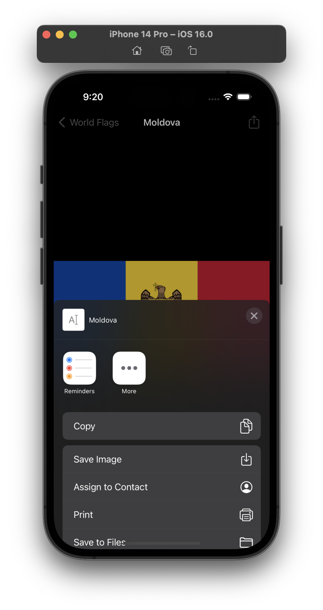

# Milestone Project - World Flags

> You have a rudimentary understanding of table views, image views, and navigation controllers, so let’s put them together: your challenge is to create an app that lists various world flags in a table view. When one of them is tapped, slide in a detail view controller that contains an image view, showing the same flag full size. On the detail view controller, add an action button that lets the user share the flag picture and country name using `UIActivityViewController`.

## Challenges

1. Start with a Single View App template, then change its main `ViewController` class so that builds on `UITableViewController` instead.
2. Load the list of available flags from the app bundle. You can type them directly into the code if you want, but it’s preferable not to.
3. Create a new Cocoa Touch Class responsible for the detail view controller, and give it properties for its image view and the image to load.
4. You’ll also need to adjust your storyboard to include the detail view controller, including using Auto Layout to pin its image view correctly.
5. You will need to use `UIActivityViewController` to share your flag.

## Screenshots

### Light Mode

  
  
  
  

### Dark Mode

  
  
  
  

