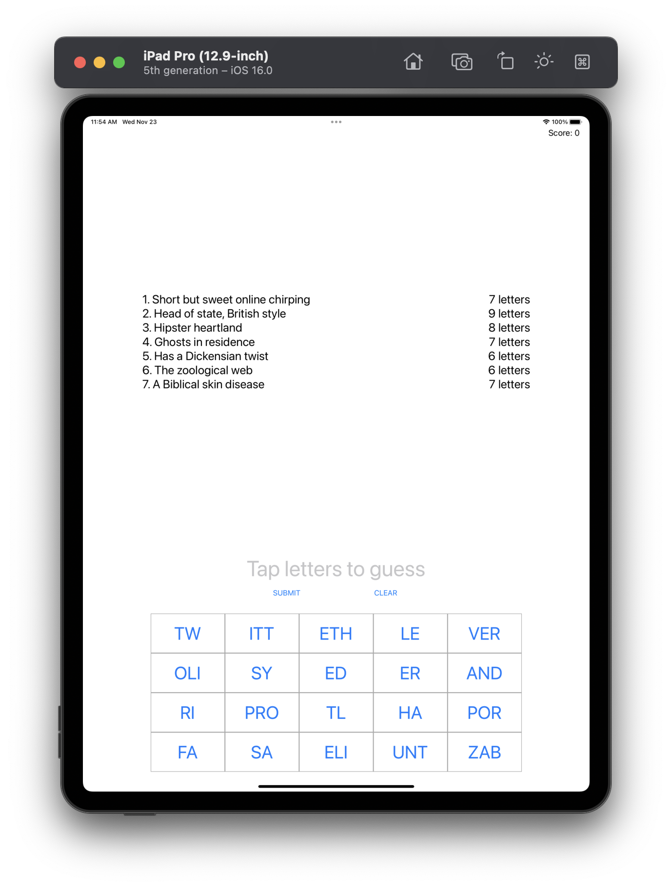
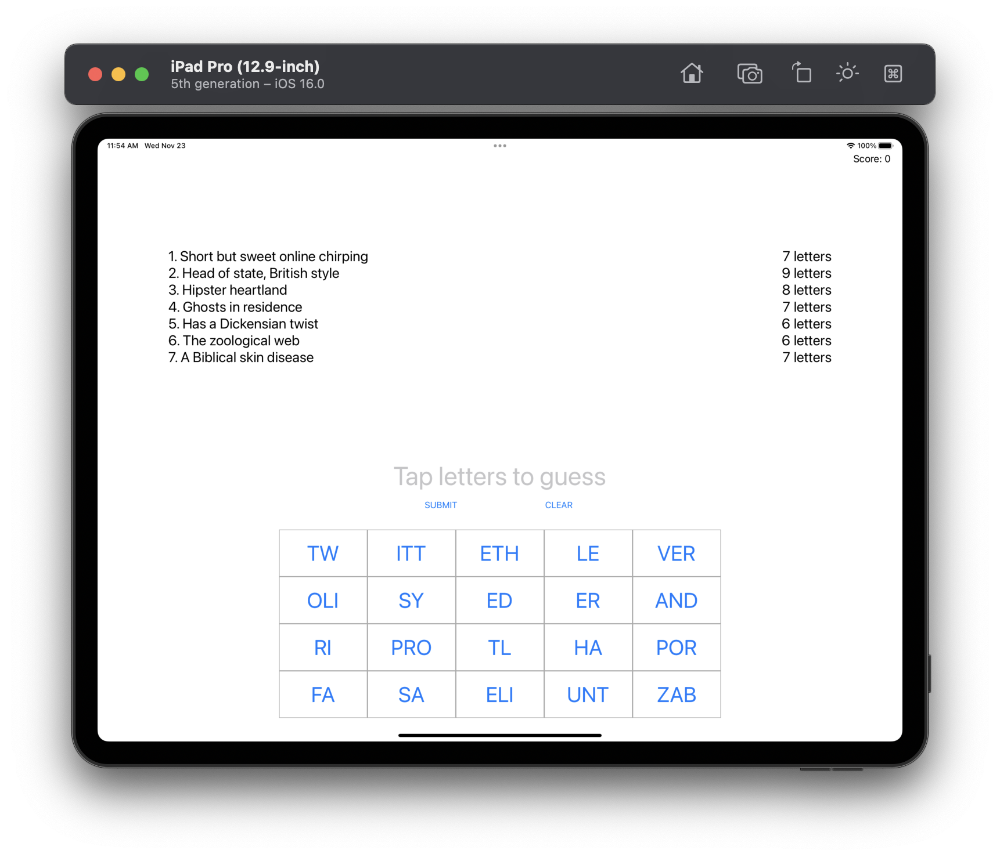
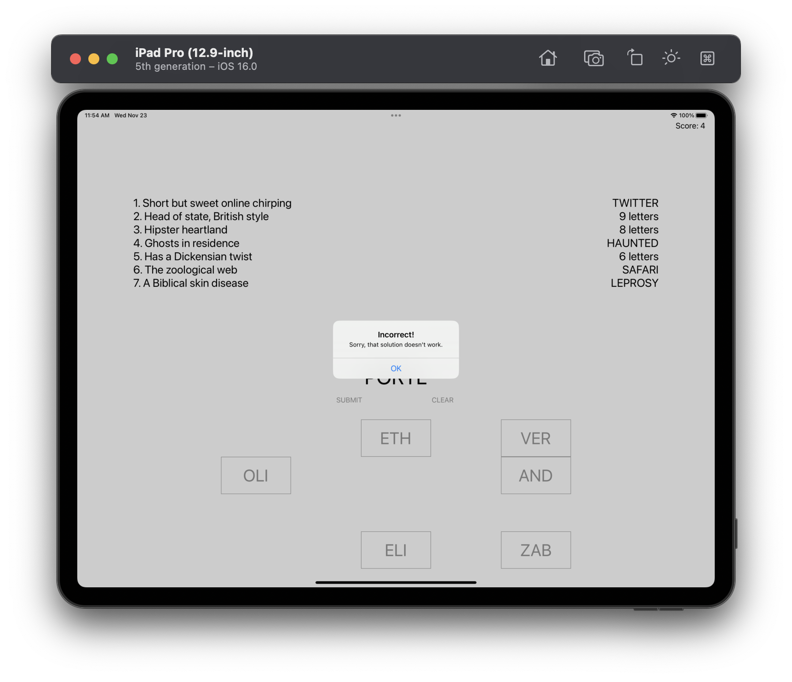

# Project 8 - Swifty Words

This project includes solutions to the challenges.

## Challenges

1. Use the techniques you learned in project 2 to draw a thin gray line around the buttons view, to make it stand out from the rest of the UI.
2. If the user enters an incorrect guess, show an alert telling them they are wrong. You’ll need to extend the `submitTapped()` method so that if `firstIndex(of:)` failed to find the guess you show the alert.
3. Try making the game also deduct points if the player makes an incorrect guess. Think about how you can move to the next level – we can’t use a simple division remainder on the player’s `score` any more, because they might have lost some points.

## Screenshots

### Light Mode

  
  
  
  

### Dark Mode

*No screenshots provided (since dark mode was not supported for the project).*
