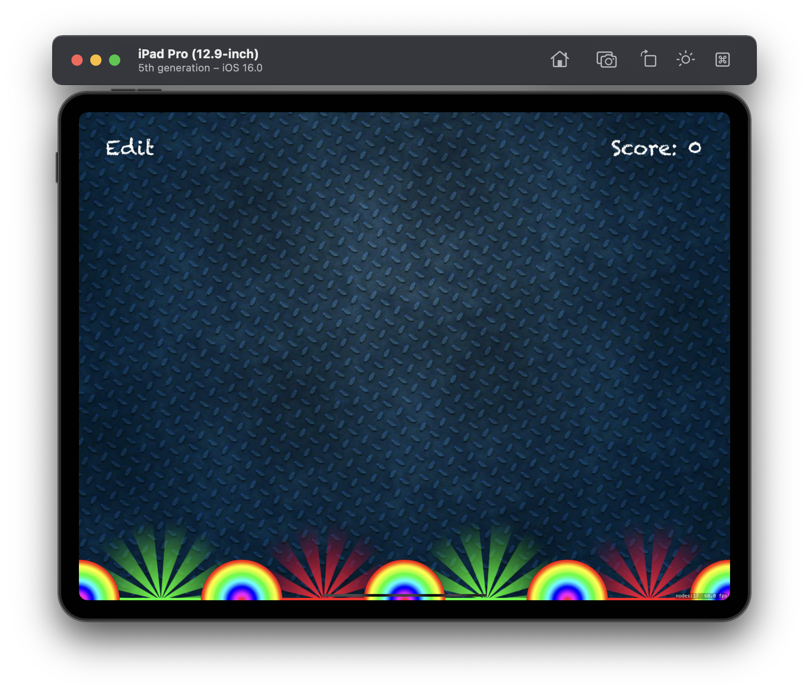
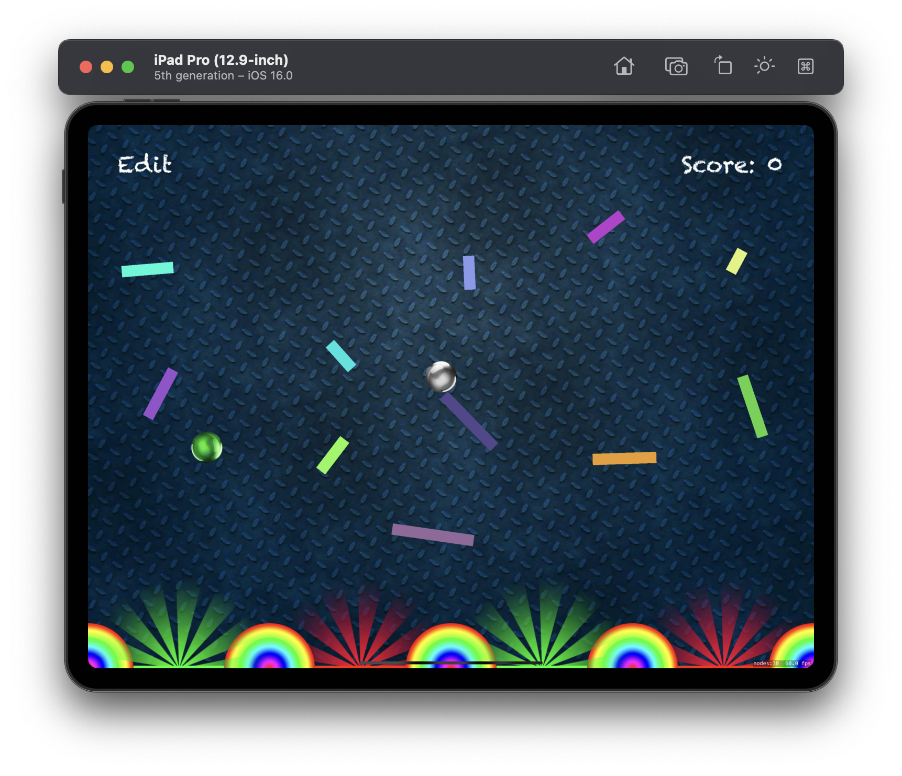
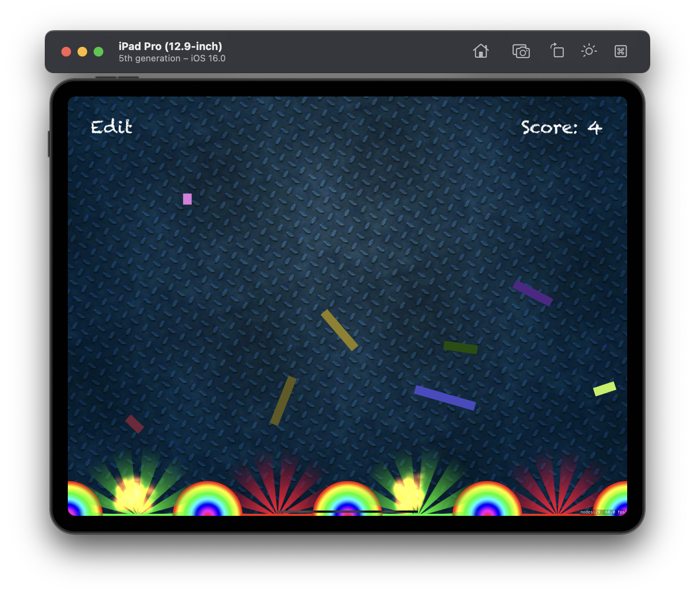

# Project 11 - Pachinko

This project includes solutions to the challenges.

## Challenges

1. The pictures we’re using in have other ball pictures rather than just “ballRed”. Try writing code to use a random ball color each time they tap the screen.
2. Right now, users can tap anywhere to have a ball created there, which makes the game too easy. Try to force the Y value of new balls so they are near the top of the screen.
3. Give players a limit of five balls, then remove obstacle boxes when they are hit. Can they clear all the pins with just five balls? You could make it so that landing on a green slot gets them an extra ball.

## Screenshots (Universal)

  
  
  
  

