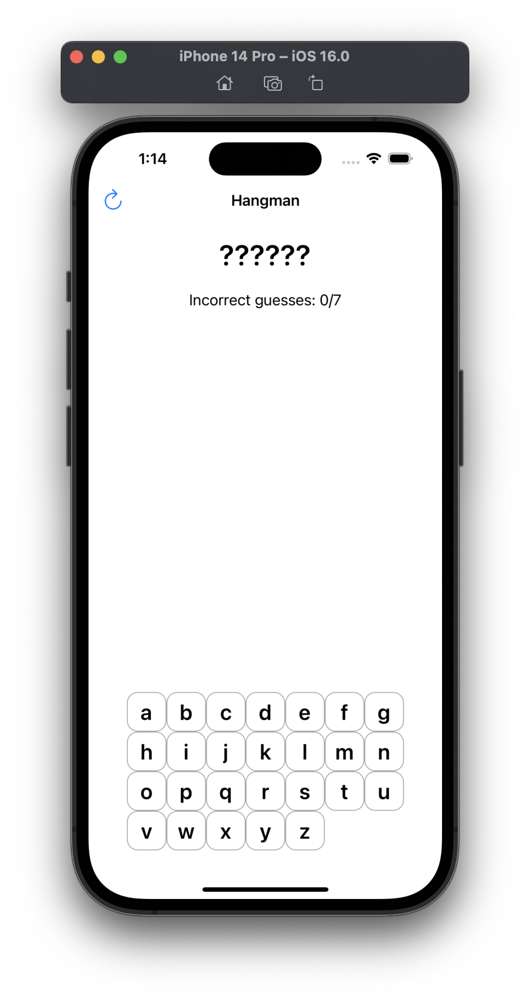
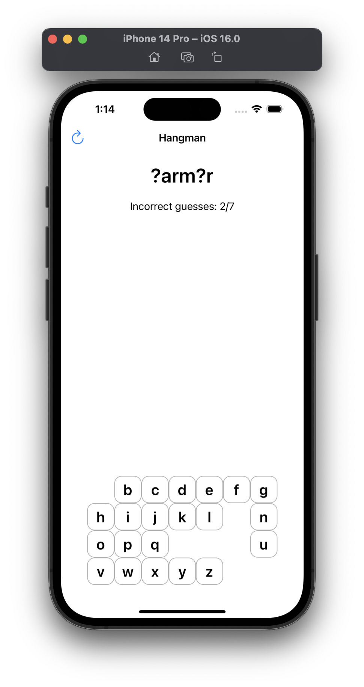
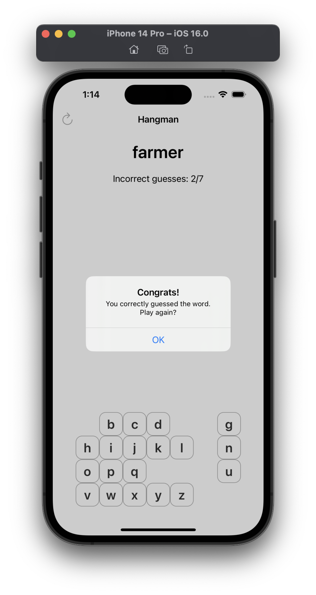
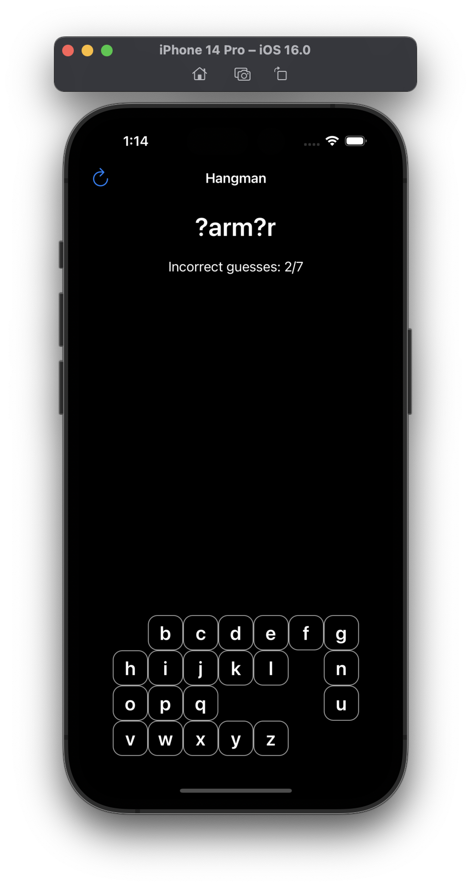

# Milestone Project - Hangman (Projects 7-9)

> This is the first challenge that involves you creating a game. You’ll still be using UIKit, though, so it’s a good chance to practice your app skills too.
>
> The challenge is this: make a hangman game using UIKit. As a reminder, this means choosing a random word from a list of possibilities, but presenting it to the user as a series of underscores. So, if your word was “RHYTHM” the user would see “??????”.
> 
> The user can then guess letters one at a time: if they guess a letter that it’s in the word, e.g. H, it gets revealed to make “?H??H?”; if they guess an incorrect letter, they inch closer to death. If they seven incorrect answers they lose, but if they manage to spell the full word before that they win.

## Challenges

*No specific challenges given.*

## Screenshots

### Light Mode

  
  
  
  

### Dark Mode

  
  
  
  

