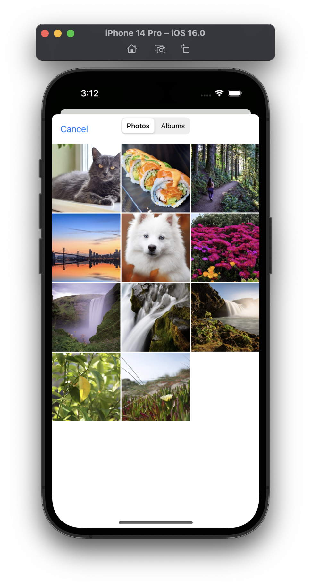
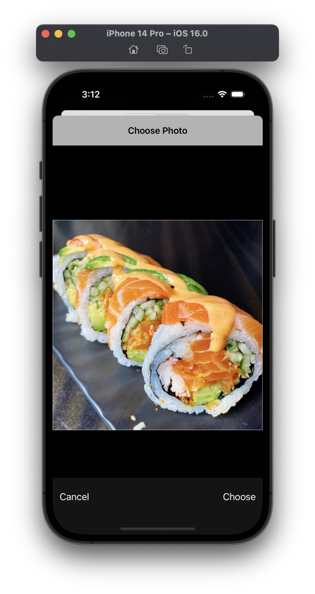
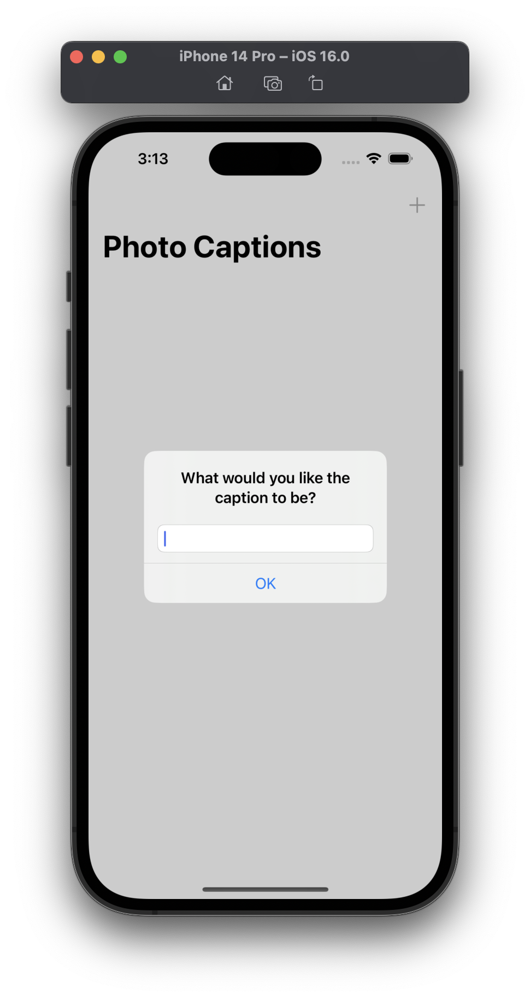
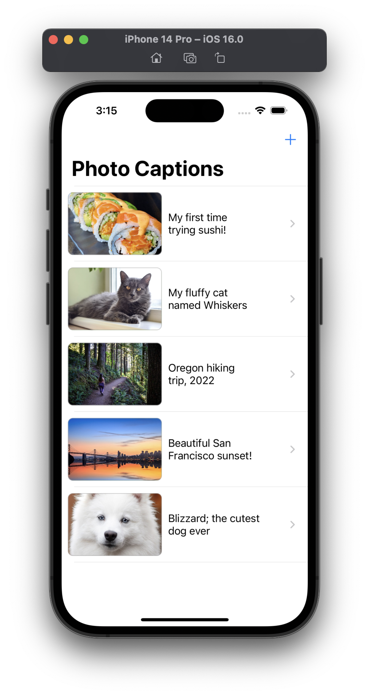
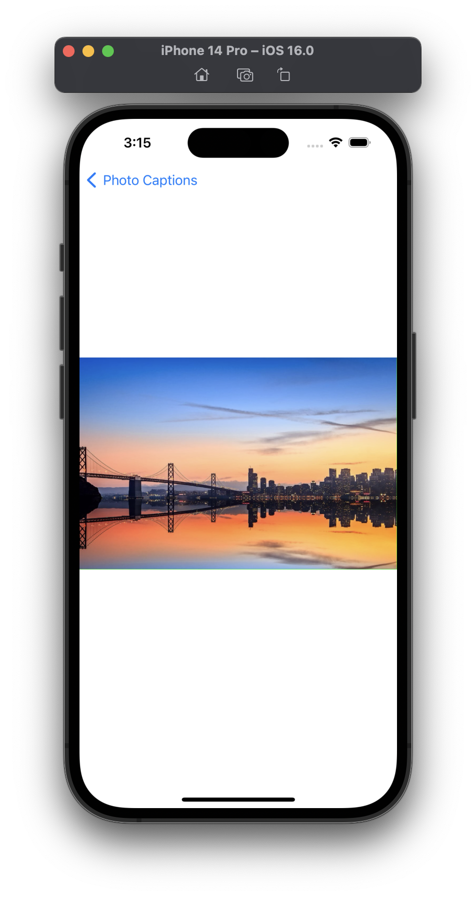
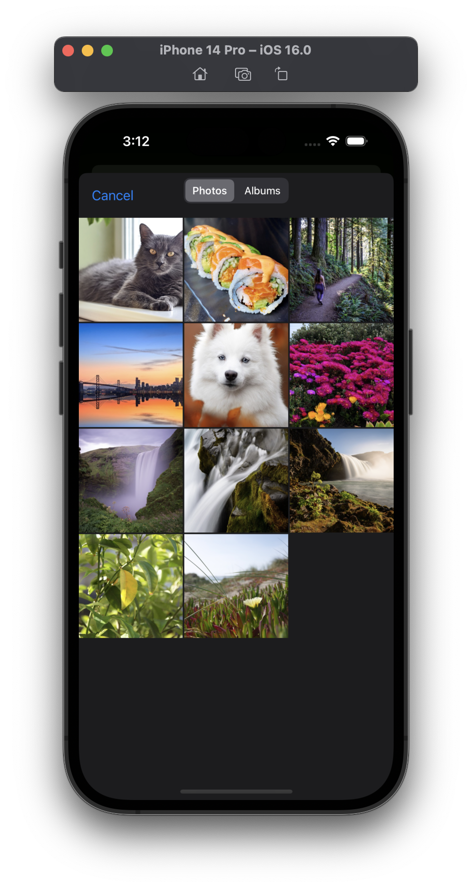
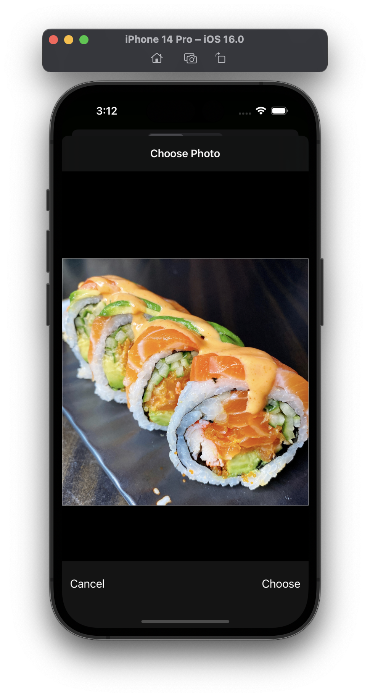
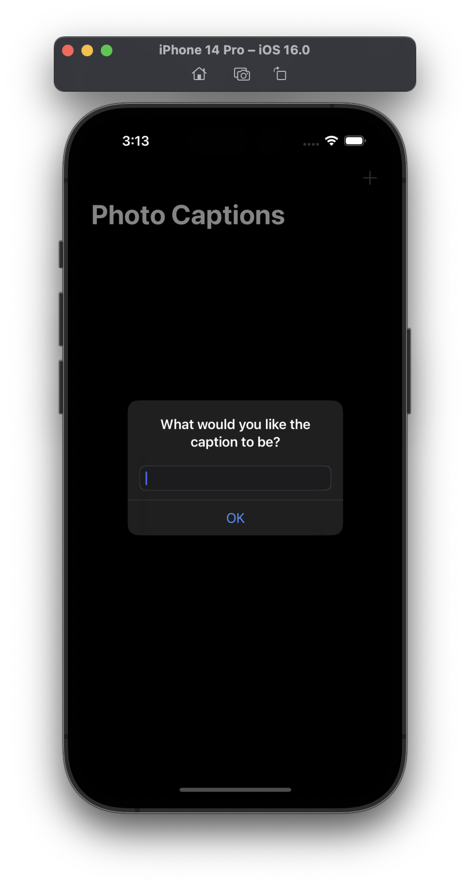
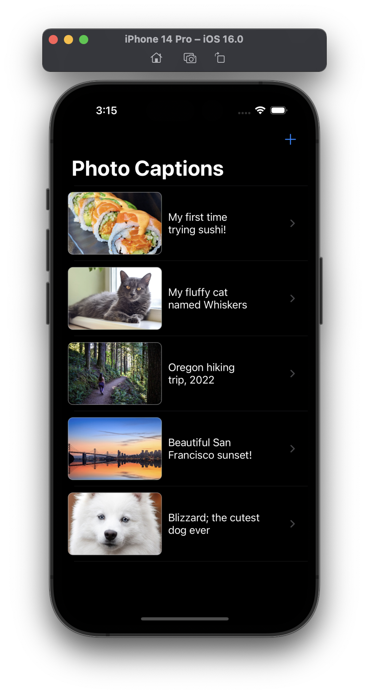
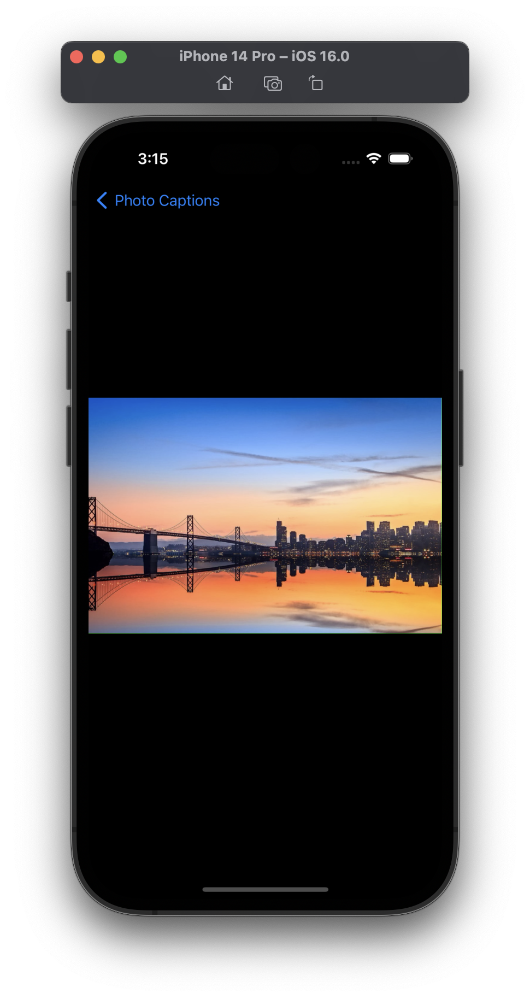

# Milestone Project - Photo Captions (Projects 10-12)

> Your challenge is to put two different projects into one: I’d like you to let users take photos of things that interest them, add captions to them, then show those photos in a table view. Tapping the caption should show the picture in a new view controller, like we did with project 1. So, your finished project needs to use elements from both project 1 and project 12, which should give you ample chance to practice.

## Challenges

*No specific challenges given.*

## Screenshots

### Light Mode

  
  
  
  
  

### Dark Mode

  
  
  
  
  

