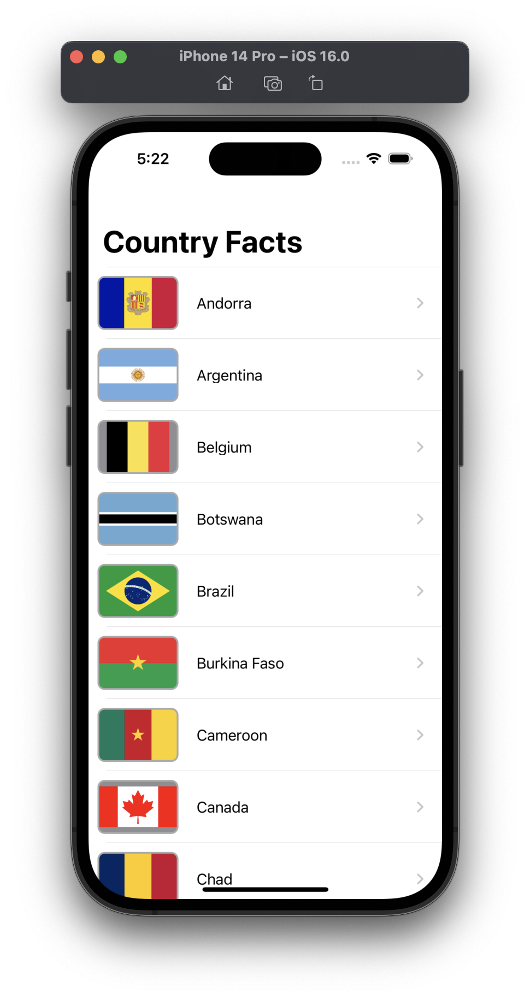
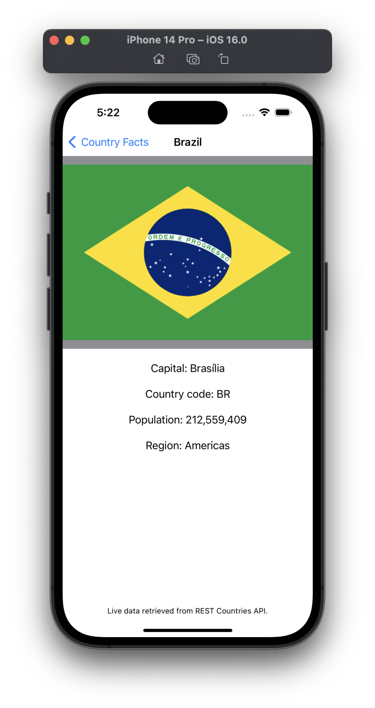
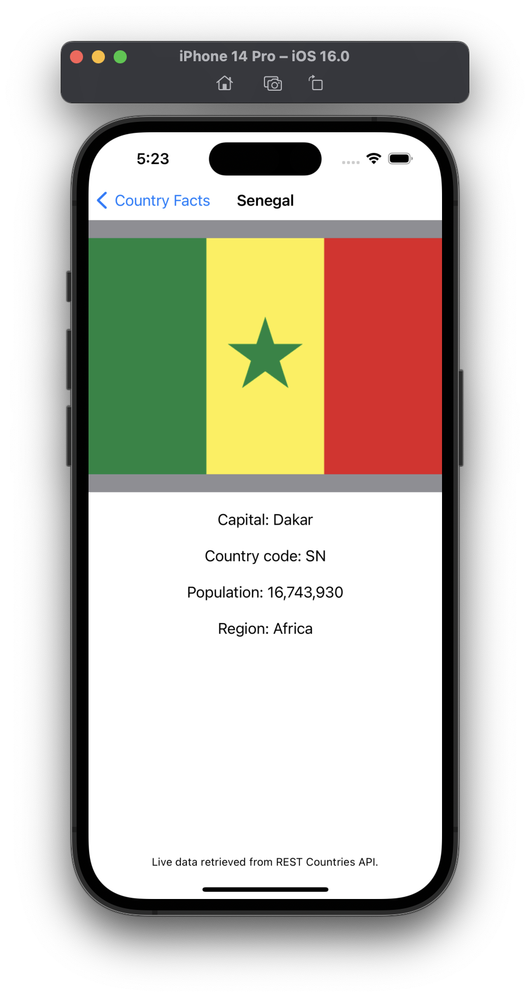
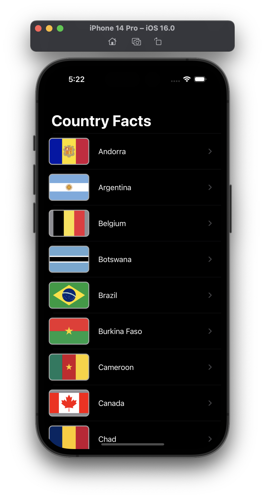
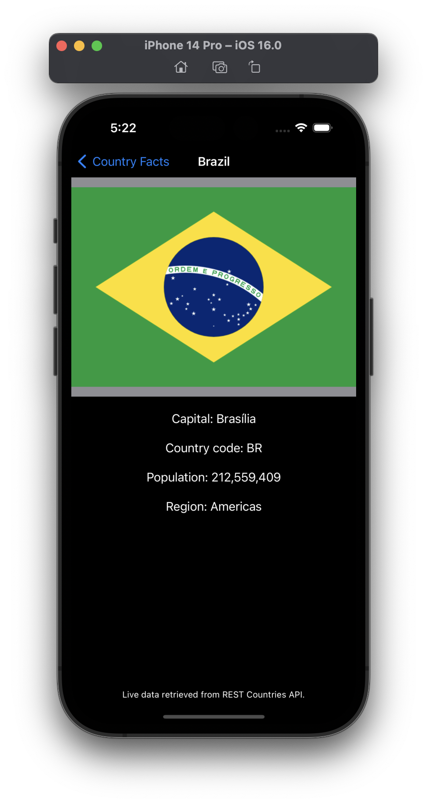
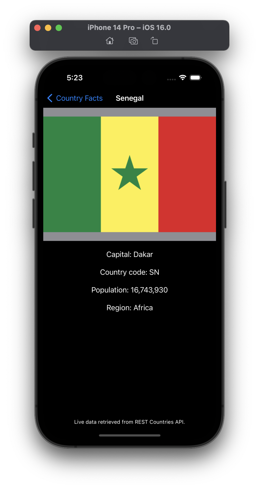

# Milestone Project - Country Facts (Projects 13-15)

> Your challenge is to make an app that contains facts about countries: show a list of country names in a table view, then when one is tapped bring in a new screen that contains its capital city, size, population, currency, and any other facts that interest you. The type of facts you include is down to you – Wikipedia has a huge selection to choose from.
>
> To make this app, I would recommend you blend parts of project 1 project 7. That means showing the country names in a table view, then showing the detailed information in a second table view.
>
> How you load data into the app is going to be an interesting problem for you to solve. I suggested project 7 above because a sensible approach would be to create a JSON file with your facts in, then load that in using contentsOf and parse it using Codable. Regardless of how you end up solving this, I suggest you don’t just hard-code it into the app – i.e., typing all the facts manually into your Swift code. You’re better than that!

## Challenges

*No specific challenges given.*

## Screenshots

### Light Mode

  
  
  

### Dark Mode

  
  
  

