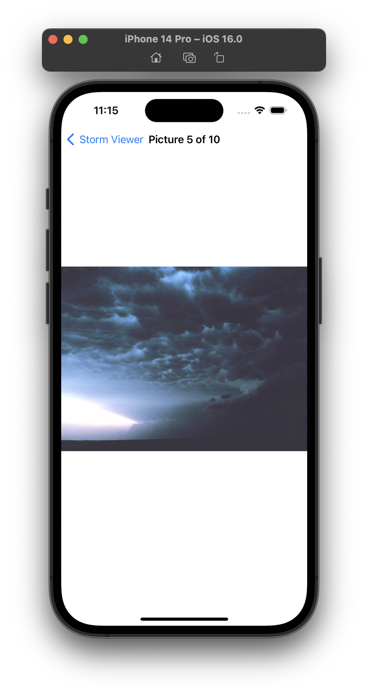
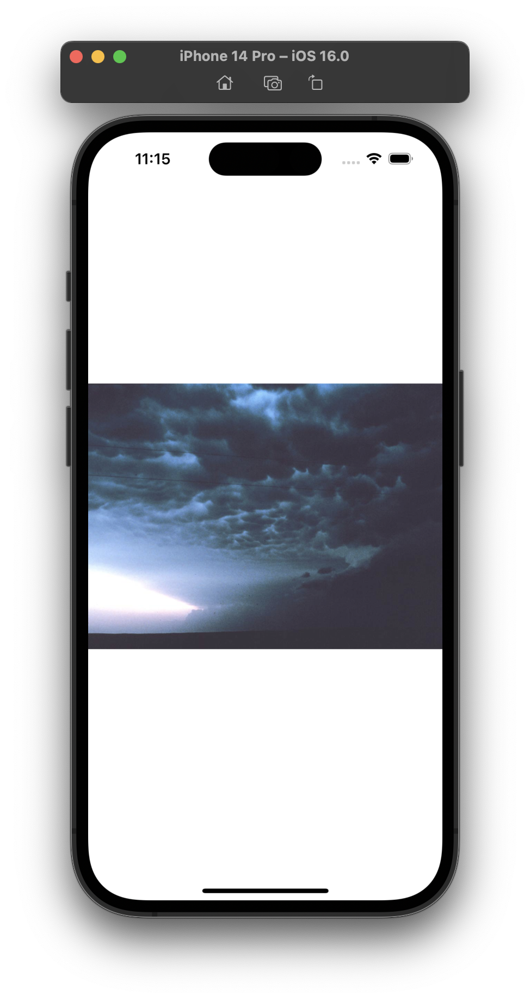
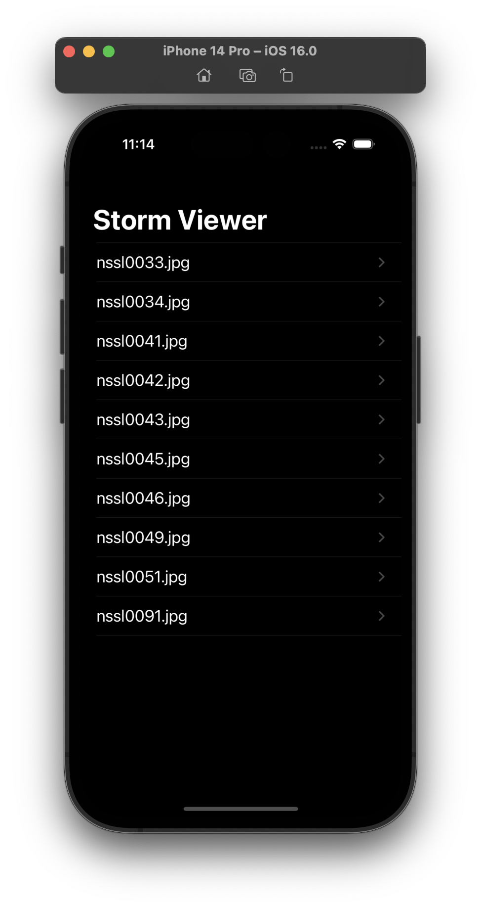
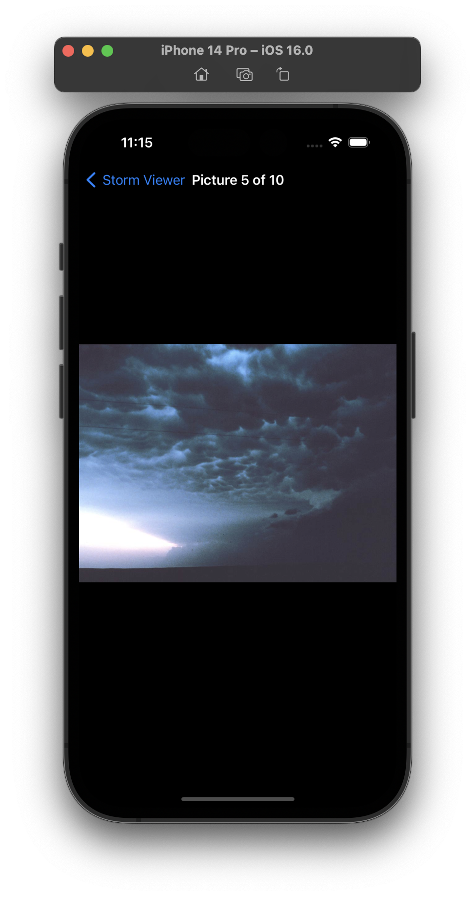

# Project 1 - Storm Viewer

This project includes solutions to the challenges.

## Challenges

1. Use Interface Builder to select the text label inside your table view cell and adjust its font size to something larger – experiment and see what looks good.
2. In your main table view, show the image names in sorted order, so “nssl0033.jpg” comes before “nssl0034.jpg”.
3. Rather than show image names in the detail title bar, show “Picture X of Y”, where Y is the total number of images and X is the selected picture’s position in the array. Make sure you count from 1 rather than 0.

## Additional Challenges

* [Project 9](../Project-09-GrandCentralDispatch) - Modify project 1 so that loading the list of NSSL images from our bundle happens in the background. Make sure you call reloadData() on the table view once loading has finished!

## Screenshots

### Light Mode

  
  
  
  

### Dark Mode

  
  
  
  

