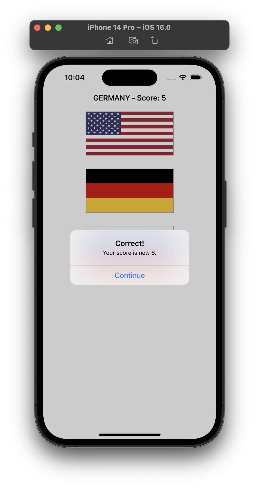
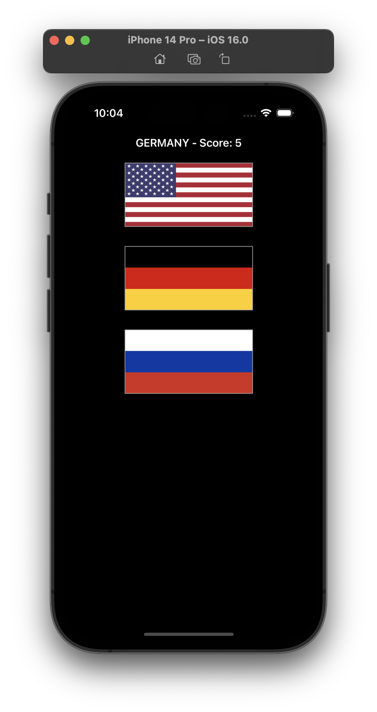

# Project 2 - Guess the Flag

This project includes solutions to the challenges.

## Challenges

1. Try showing the player’s score in the navigation bar, alongside the flag to guess.
2. Keep track of how many questions have been asked, and show one final alert controller after they have answered 10. This should show their final score.
3. When someone chooses the wrong flag, tell them their mistake in your alert message – something like “Wrong! That’s the flag of France,” for example.

## Additional Challenges

* [Project 15](../Project-15-Animation) - Go back to project 2 and make the flags scale down with a little bounce when pressed.

## Screenshots

### Light Mode

  
  
  
  

### Dark Mode

  
  
  
  

