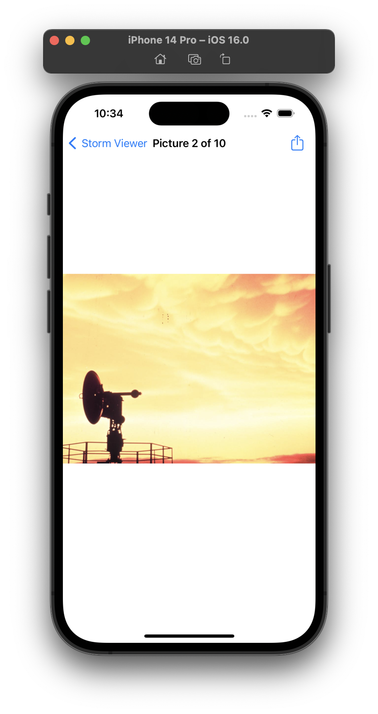
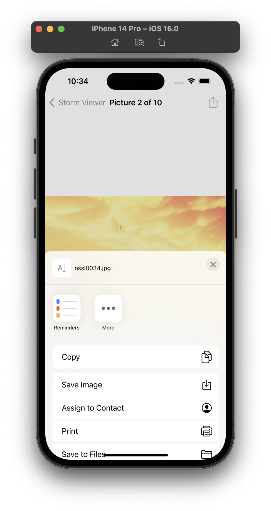
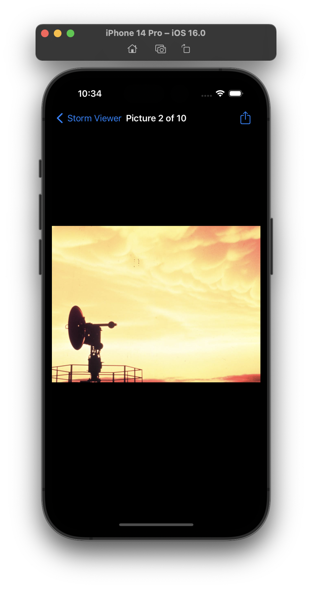
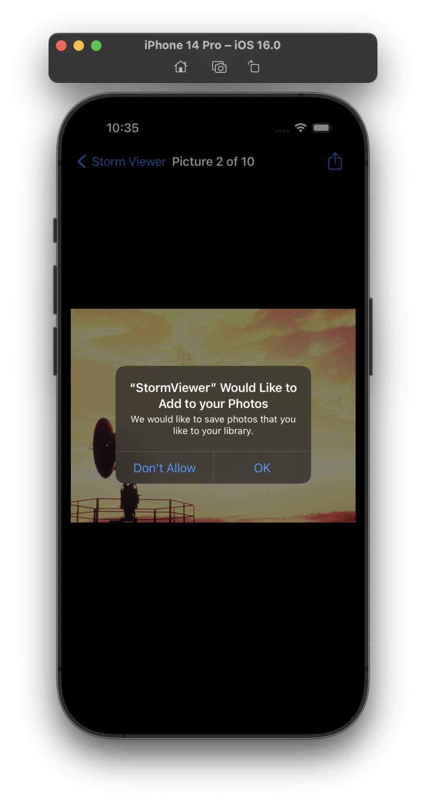

# Project 3 - Social Media (Extension of Project 1 - Storm Viewer)

This project includes solutions to the challenges.

## Challenges

1. Try adding the image name to the list of items that are shared. The `activityItems` parameter is an array, so you can add strings and other things freely. Note: Facebook won’t let you share text, but most other share options will.
2. Go back to [project 1](./01-Project-1-StormViewer) and add a bar button item to the main view controller that recommends the app to other people.
3. Go back to [project 2](./02-Project-2-GuessTheFlag) and add a bar button item that shows their score when tapped.

## Screenshots

### Light Mode

  
  
  

### Dark Mode

  
  
  

