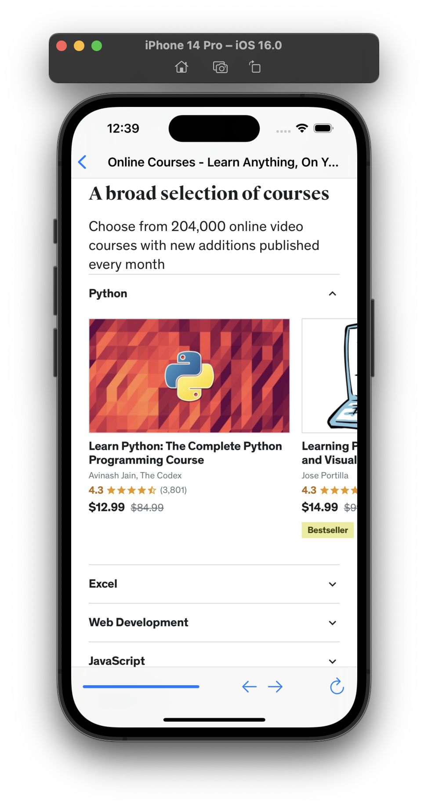

# Project 4 - Easy Browser

This project includes solutions to the challenges.

## Challenges

1. ~If users try to visit a URL that isn’t allowed, show an alert saying it’s blocked.~ [ISSUE]
2. Try making two new toolbar items with the titles Back and Forward. You should make them use `webView.goBack` and `webView.goForward`.
3. For more of a challenge, try changing the initial view controller to a table view like in project 1, where users can choose their website from a list rather than just having the first in the array loaded up front.

## Screenshots

### Light Mode

  
  
  

### Dark Mode

  
  
  

