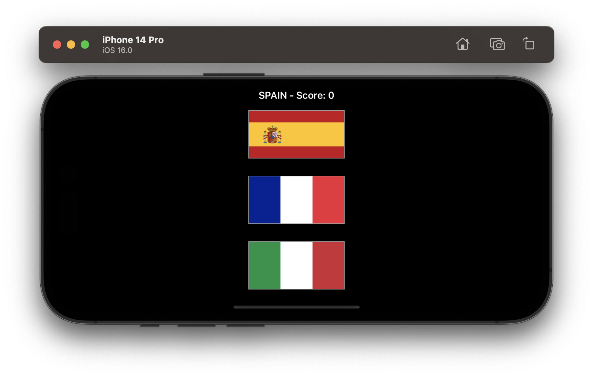

# Project 6A - Guess the Flag [Extended]

This project is an extension of [Project 2: Guess the Flag](../Project-02-GuessTheFlag).

## Summary
This project adds Auto Layout to Project 2. The game will now display properly when the device is rotated horizontally. The flags will change their height & width to fit the screen but maintain their aspect ratio.

## Screenshots

### Light Mode

  

### Dark Mode

  

