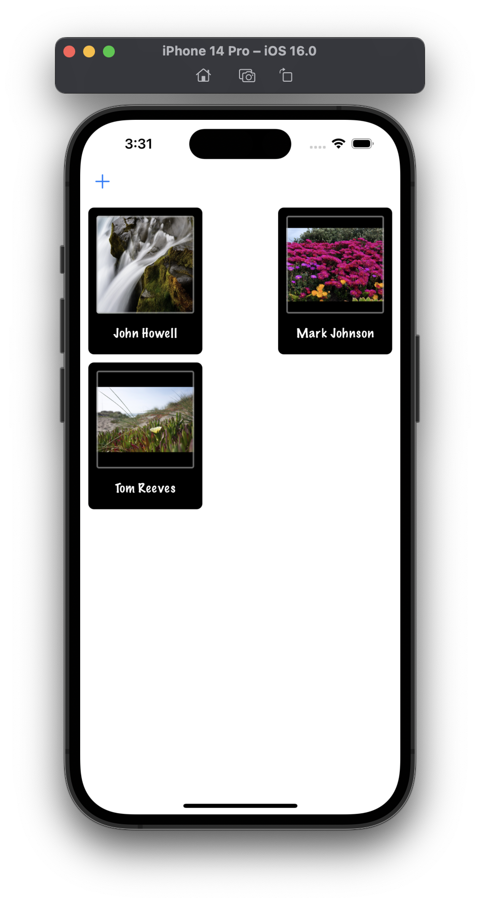
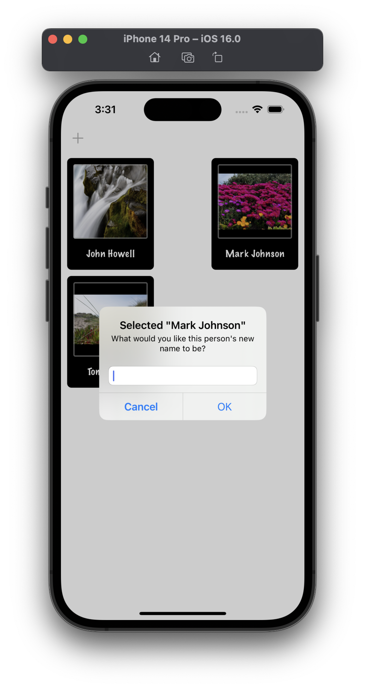
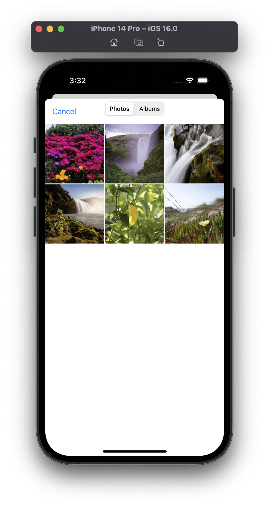
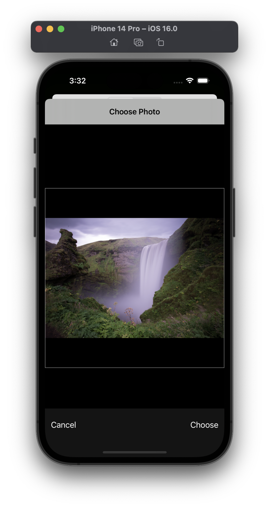
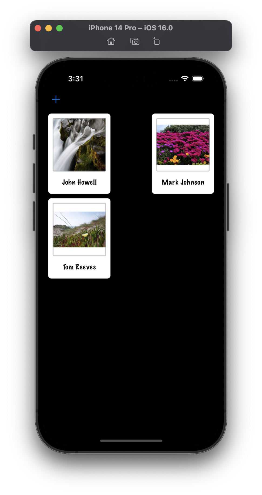
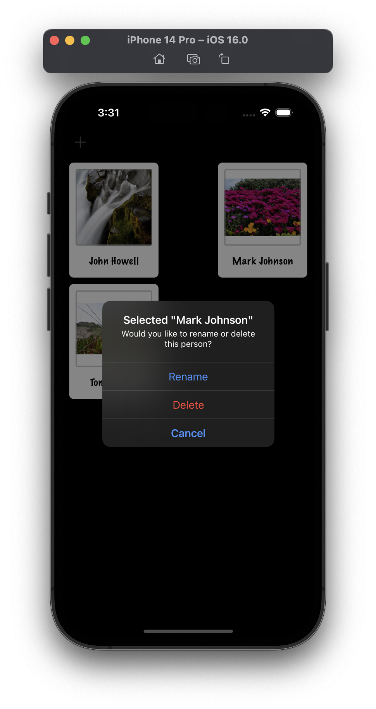
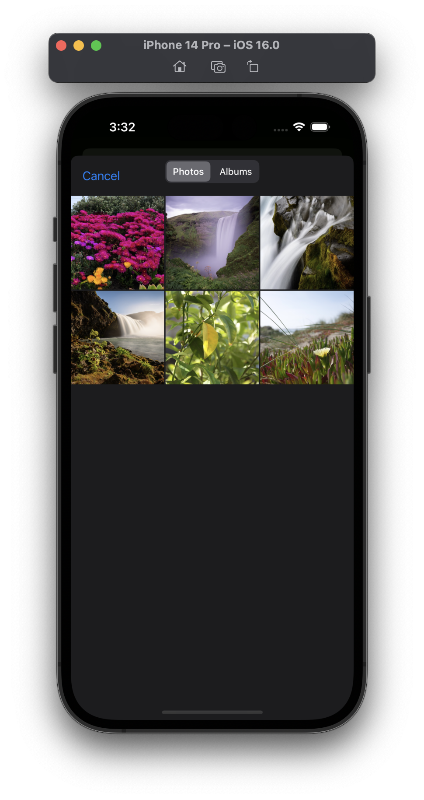

# Project 10 - Names to Faces

This project includes solutions to the challenges.

## Challenges

1. Add a second `UIAlertController` that gets shown when the user taps a picture, asking them whether they want to rename the person or delete them.
2. ~Try using `picker.sourceType = .camera` when creating your image picker, which will tell it to create a new image by taking a photo. This is only available on devices (not on the simulator) so you might want to check the return value of `UIImagePickerController.isSourceTypeAvailable()` before trying to use it!~ [MISSING]
4. ~Modify project 1 so that it uses a collection view controller rather than a table view controller. I recommend you keep a copy of your original table view controller code so you can refer back to it later on.~ [MISSING]

## Screenshots

### Light Mode

  
  
  
  
  

### Dark Mode

  
  
  
  
  

