# Project 13 - Instafilter

This project includes solutions to the challenges.

## Challenges

1. Try making the Save button show an error if there was no image in the image view.
2. Make the Change Filter button change its title to show the name of the currently selected filter.
3. Experiment with having more than one slider, to control each of the input keys you care about. For example, you might have one for radius and one for intensity.

## Screenshots

### Light Mode

  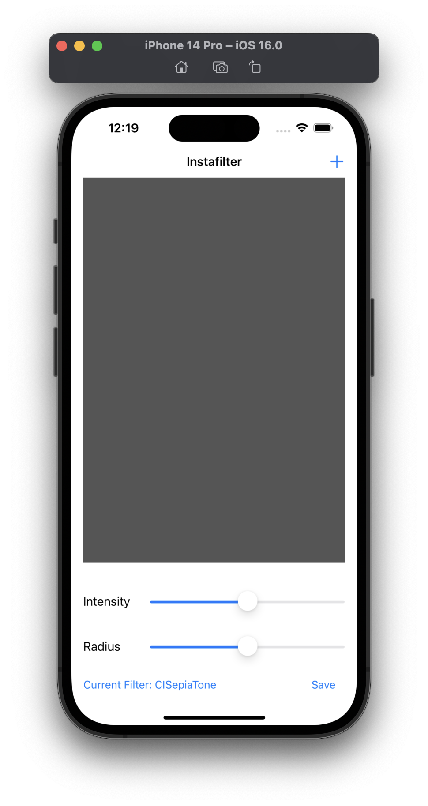
  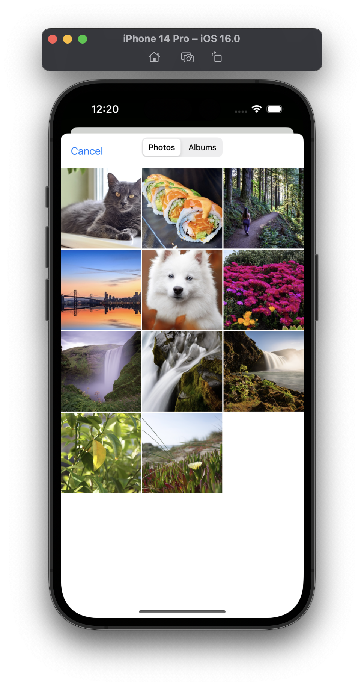
  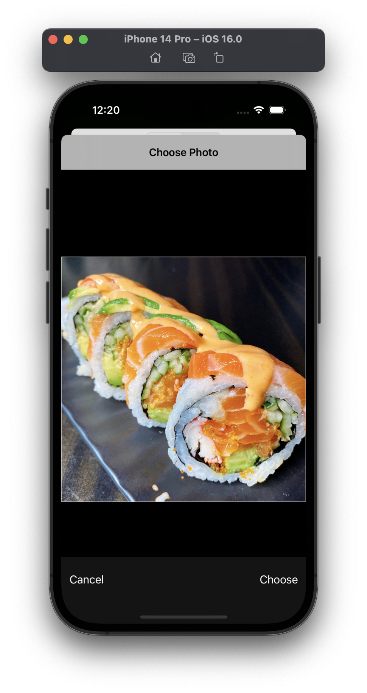
  
  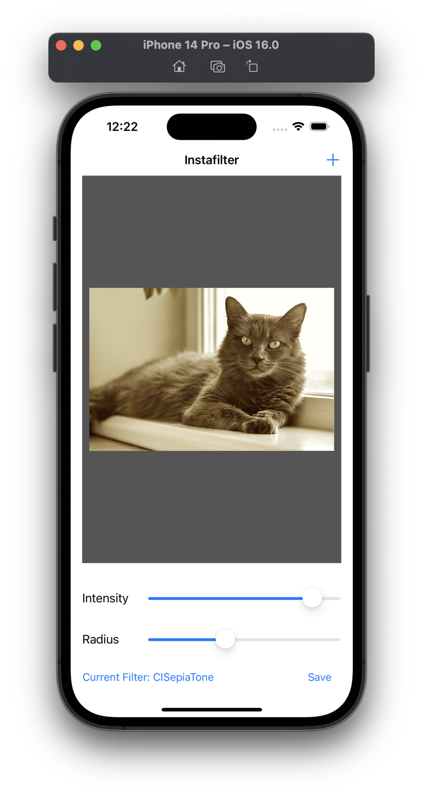
  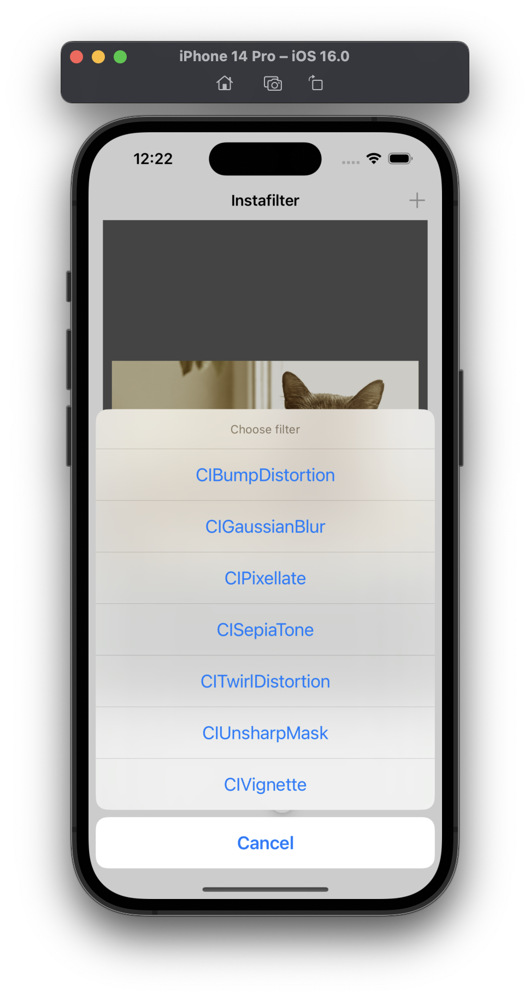
  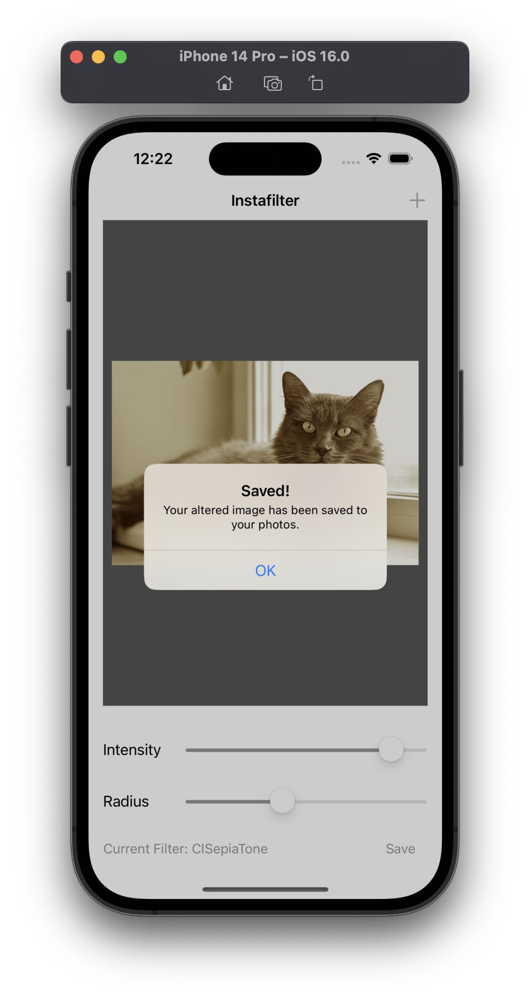
  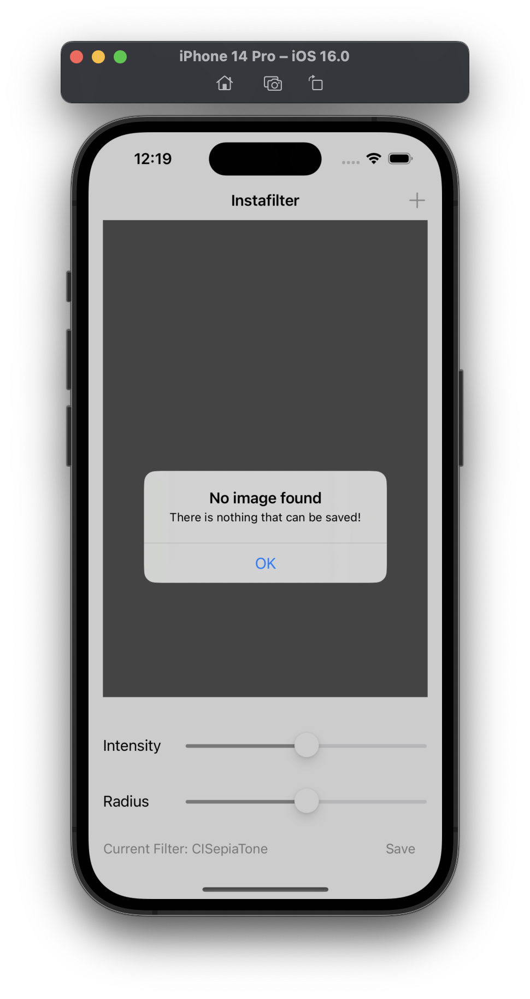

### Dark Mode

  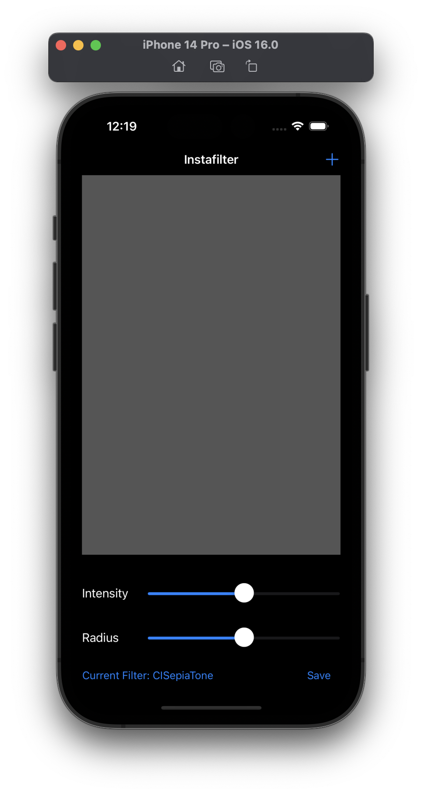
  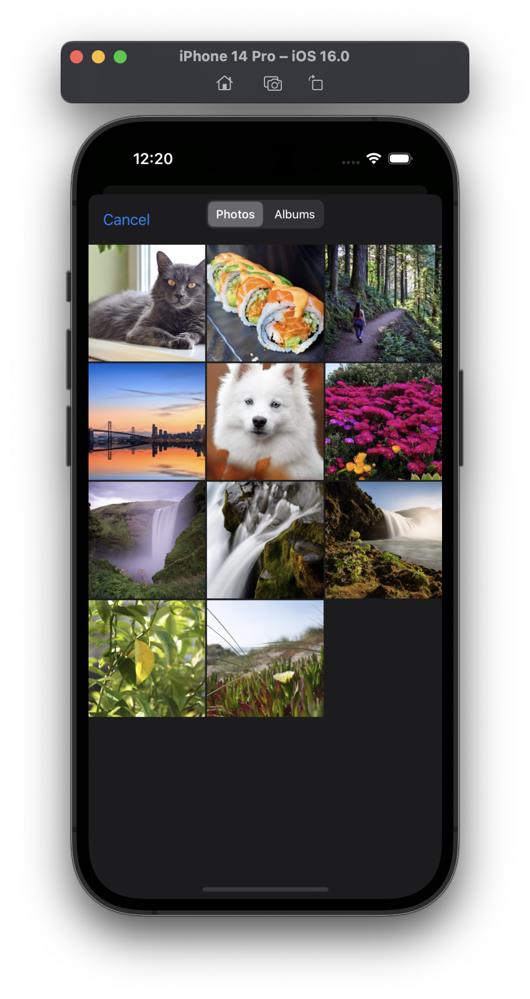
  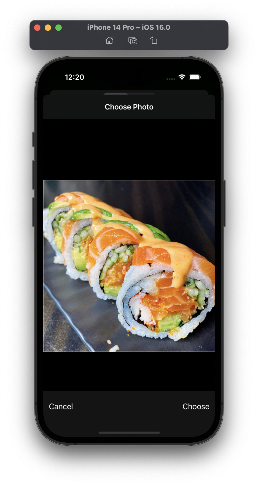
  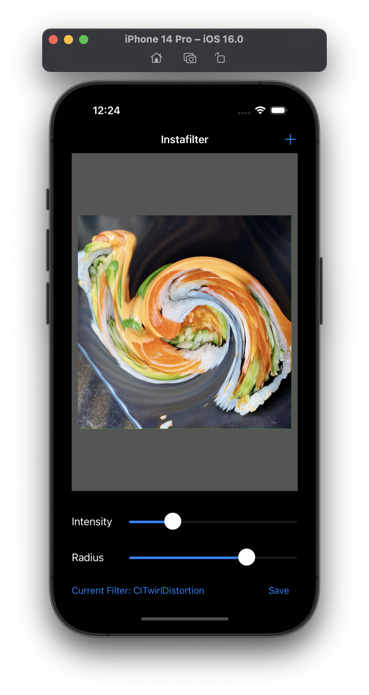
  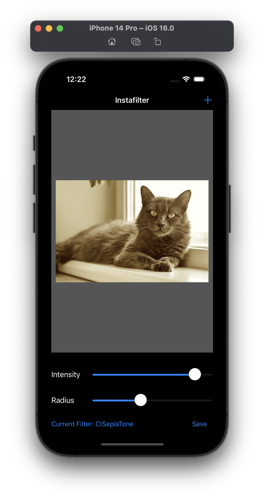
  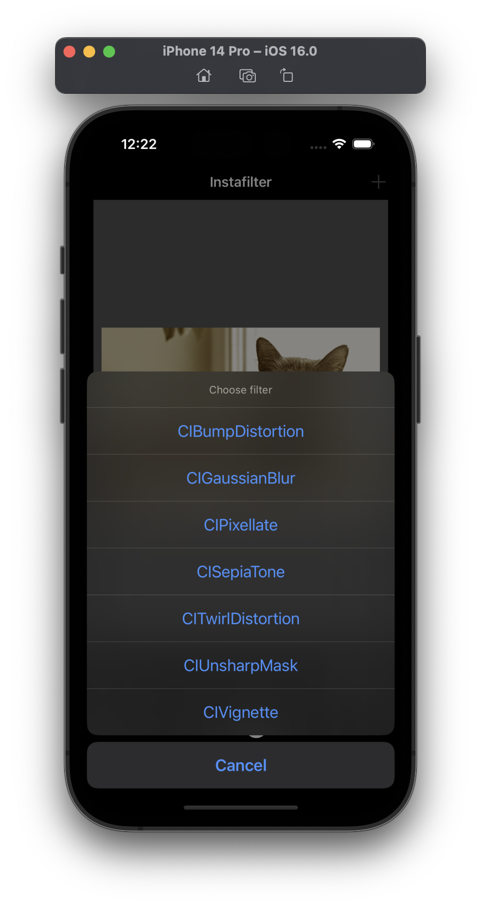
  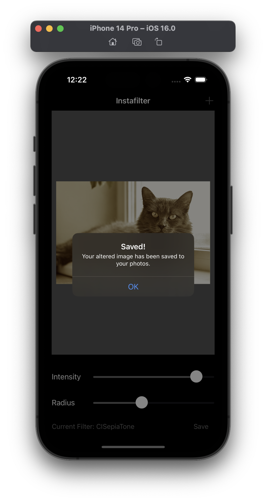
  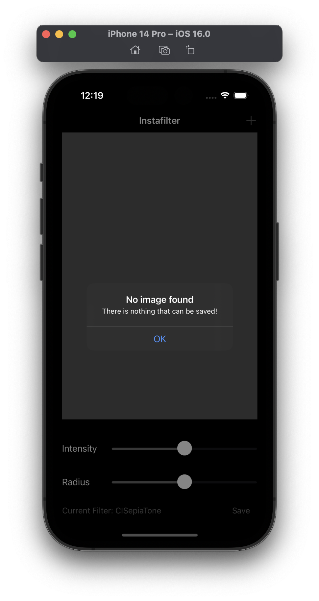

