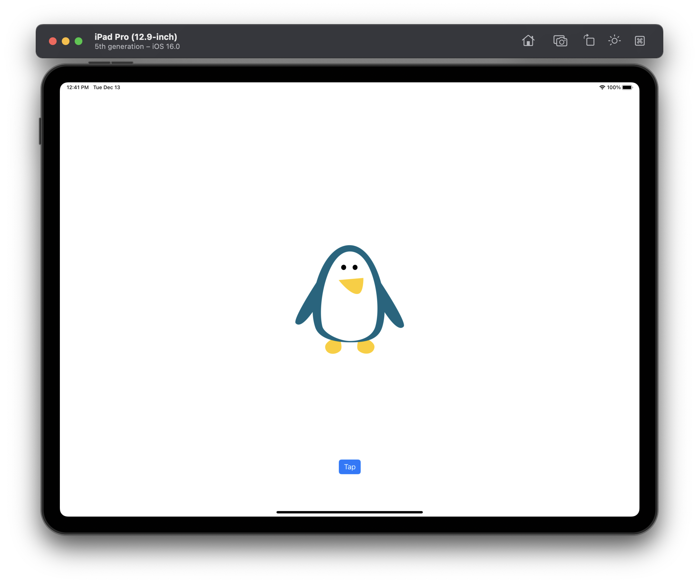
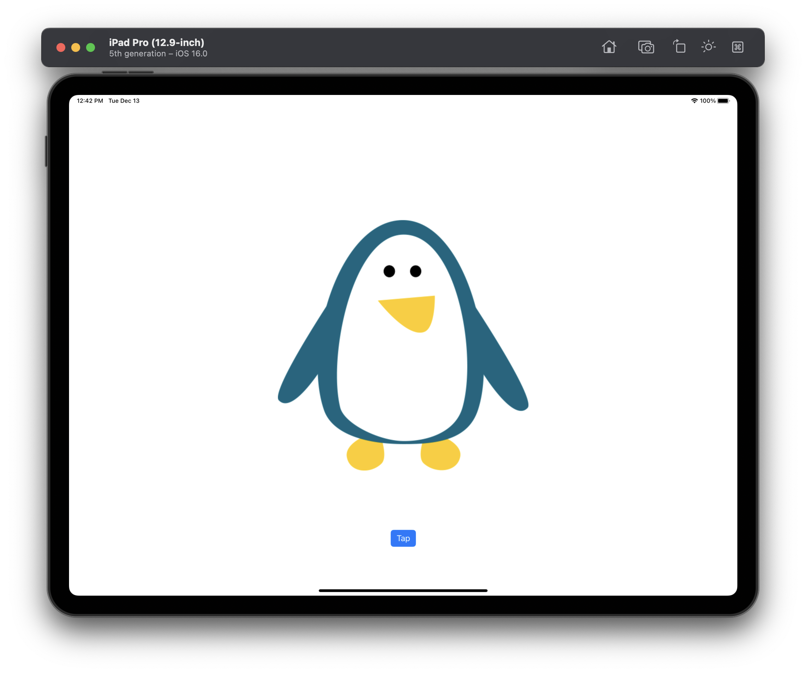
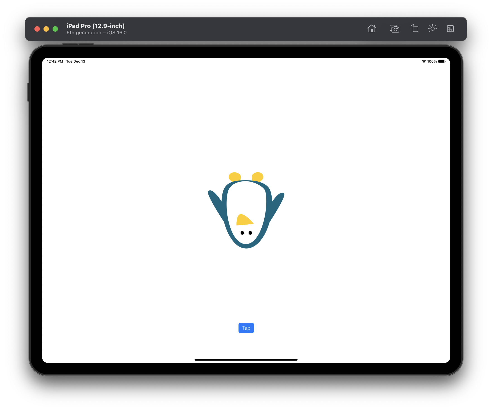
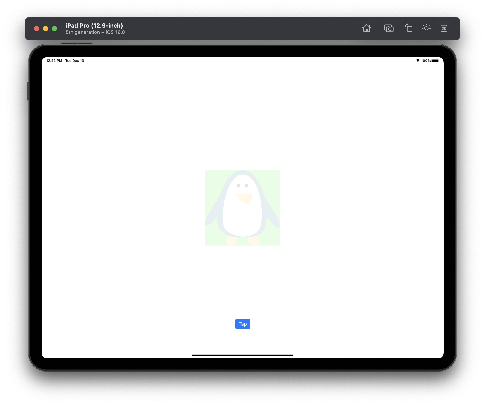
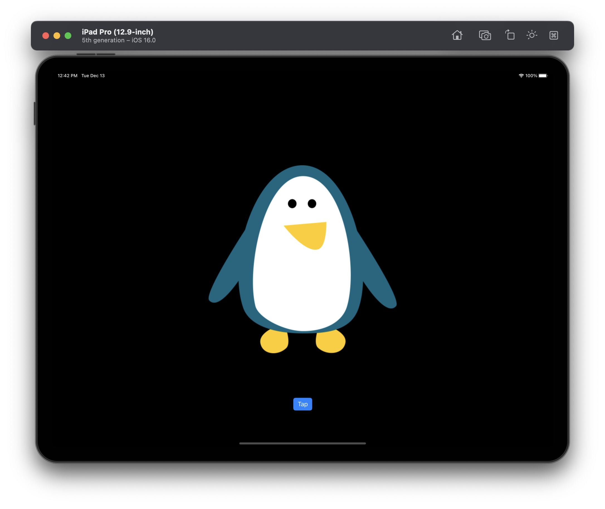
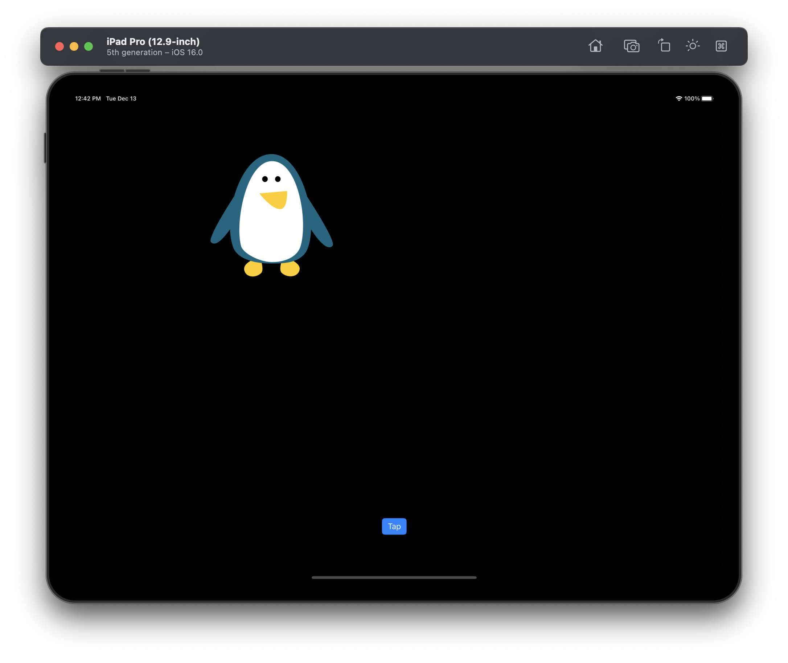
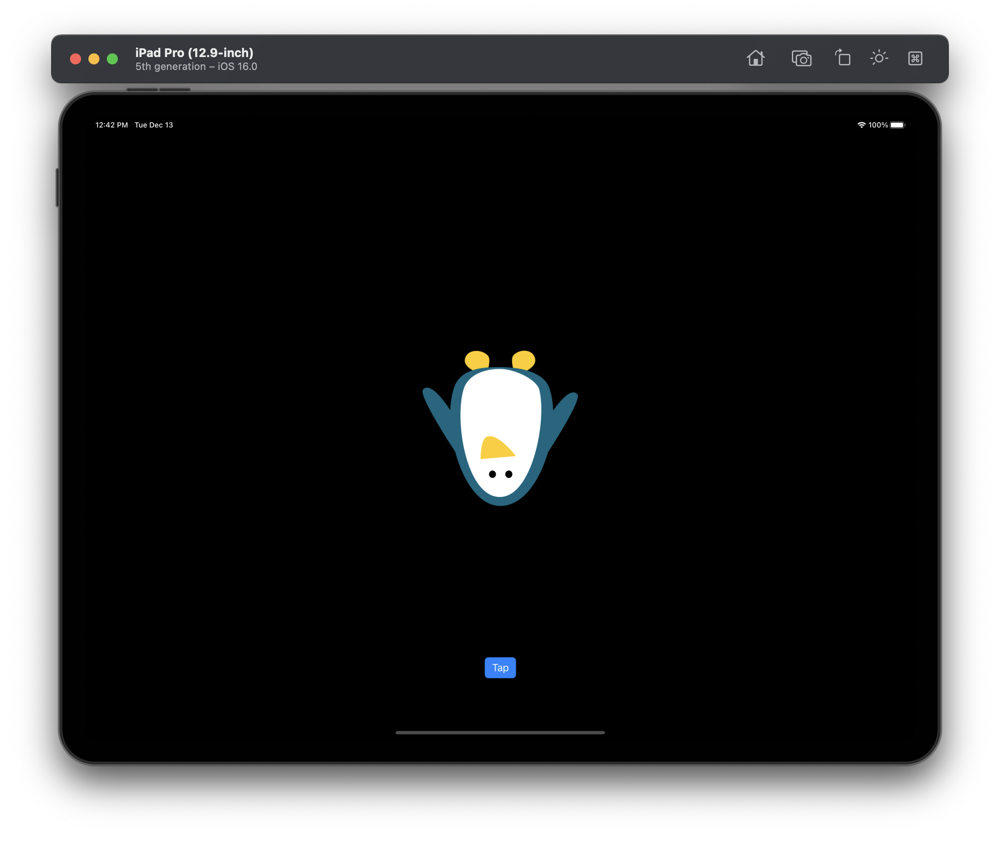
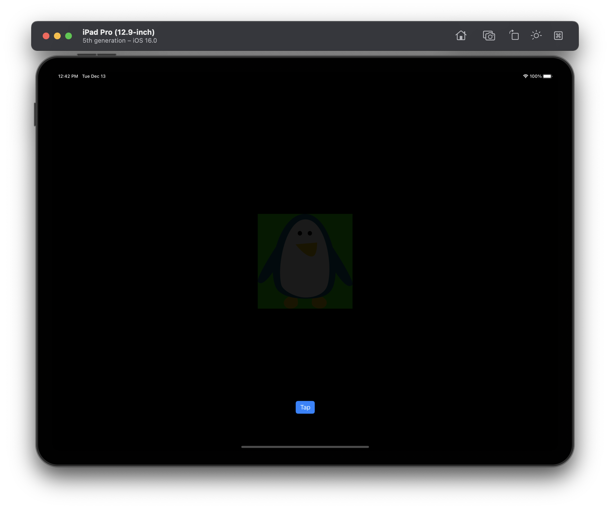

# Project 15 - Animation

This project includes solutions to the challenges.

## Challenges

1. Go back to [project 8](Project-08-SwiftyWords) and make the letter group buttons fade out when they are tapped. We were using the isHidden property, but you'll need to switch to alpha because isHidden is either true or false, it has no animatable values between.
2. Go back to [project 13](Project-13-Instafilter) and make the image view fade in when a new picture is chosen. To make this work, set the alpha to 0 first.
3. Go back to [project 2](Project-02-GuessTheFlag) and make the flags scale down with a little bounce when pressed.

## Screenshots

### Light Mode

  
  
  
  
  

### Dark Mode

  
  
  
  
  

