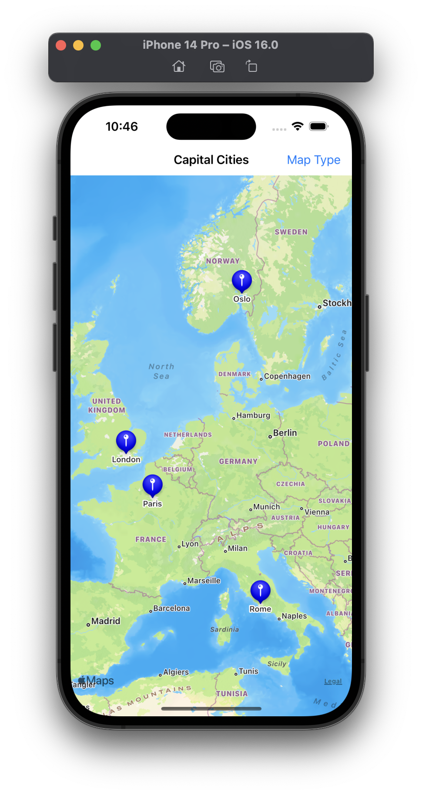
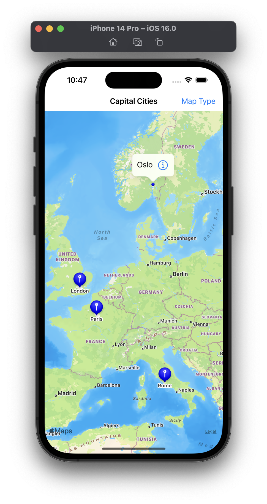
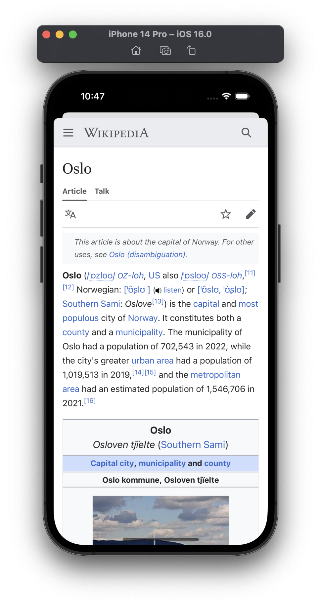
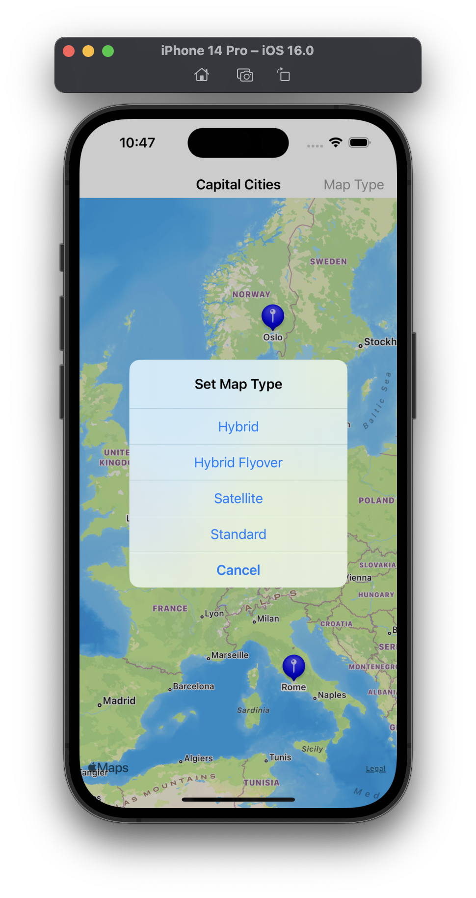
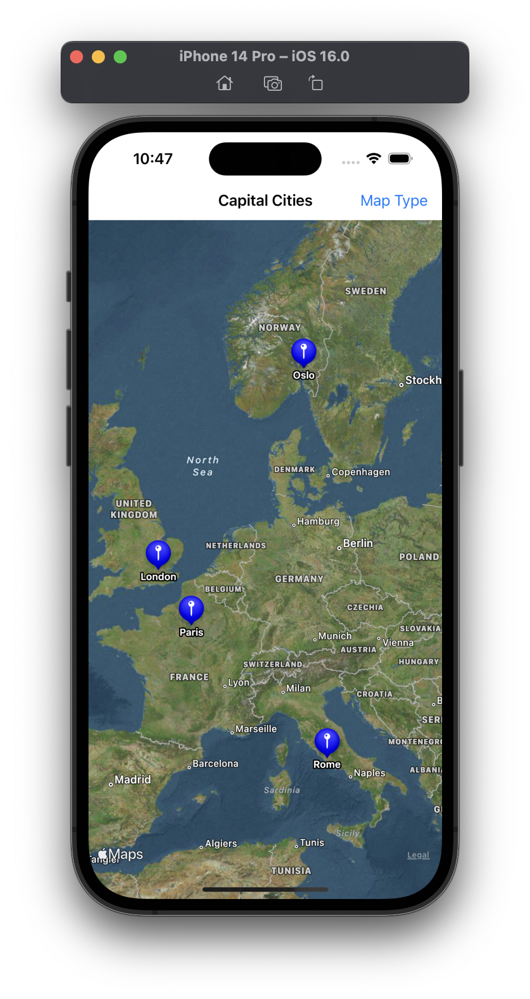
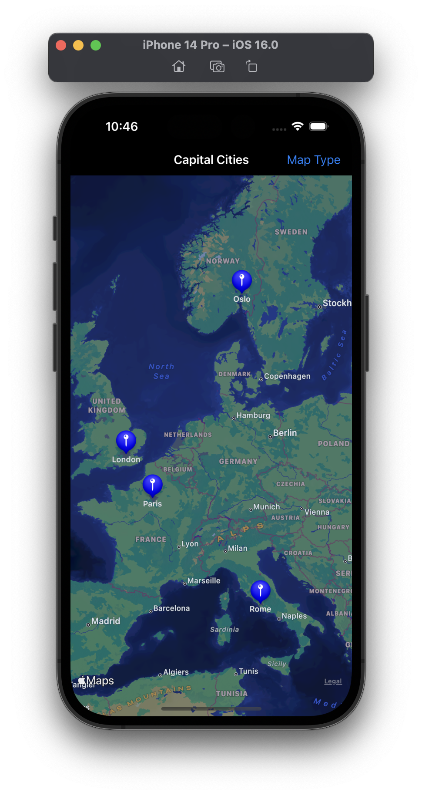
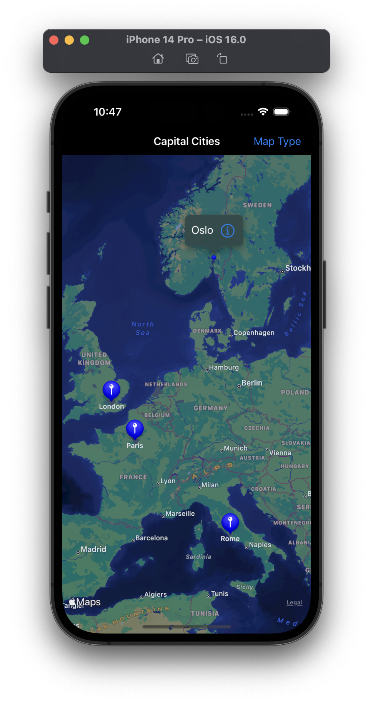
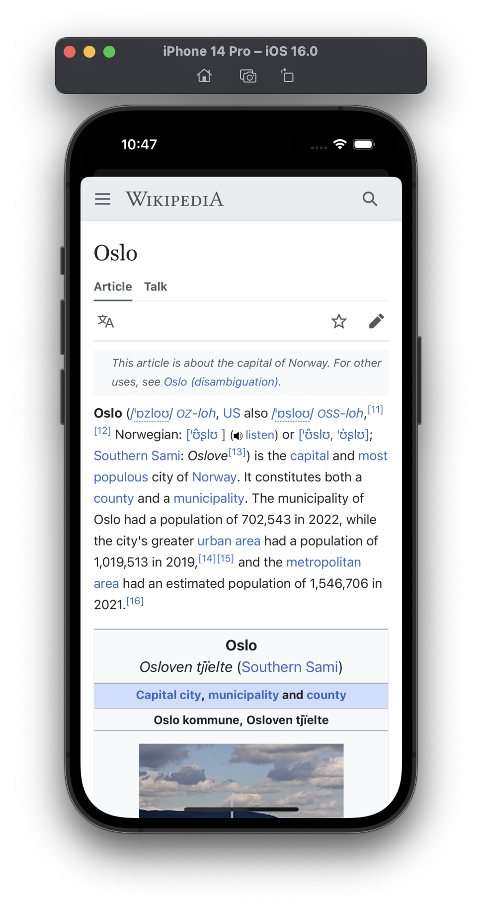
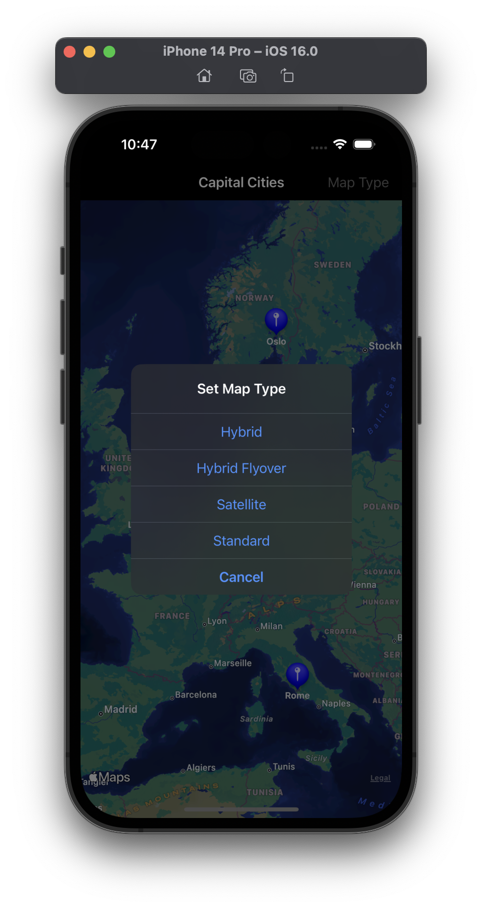
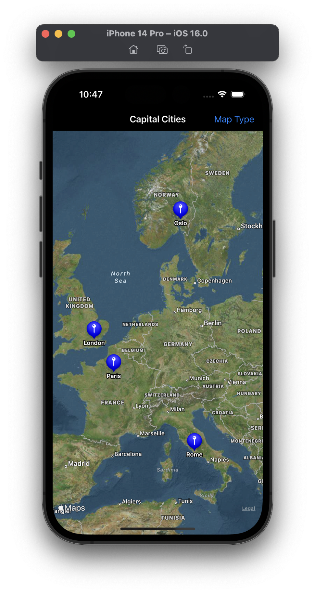

# Project 16 - Capital Cities

This project includes solutions to the challenges.

## Challenges
1. Try typecasting the return value from dequeueReusableAnnotationView() so that it's an ~~`MKPinAnnotationView`~~ `MKMarkerAnnotationView`. Once that’s done, change the ~~`pinTintColor`~~ `markerTintColor` property to your favorite `UIColor`.
2. Add a `UIAlertController` that lets users specify how they want to view the map. There's a `mapType` property that draws the maps in different ways. For example, `.satellite` gives a satellite view of the terrain.
3. Modify the callout button so that pressing it shows a new view controller with a web view, taking users to the Wikipedia entry for that city.

## Screenshots

### Light Mode

  
  
  
  
  

### Dark Mode

  
  
  
  
  

