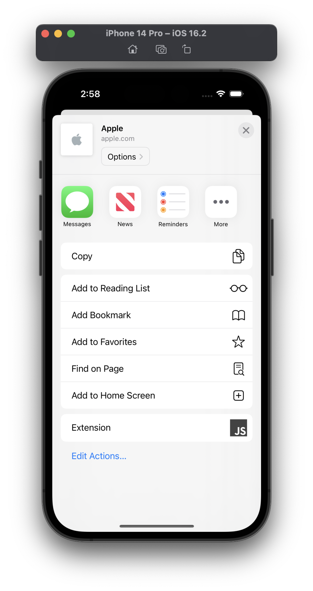
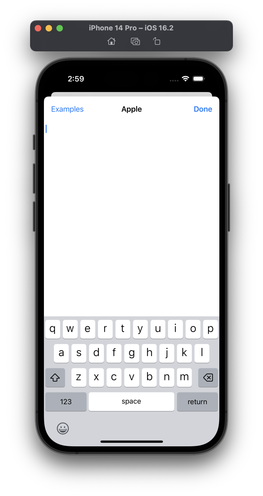
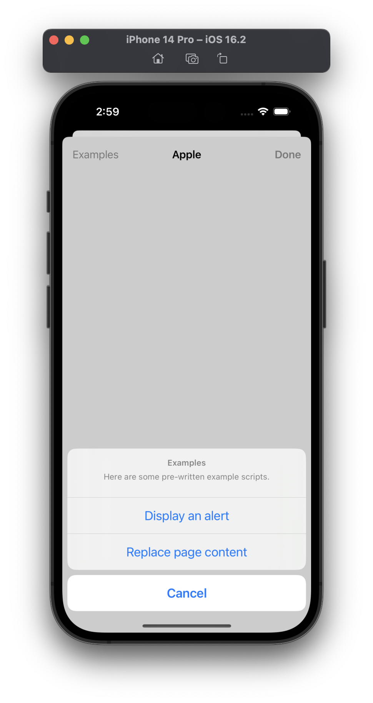
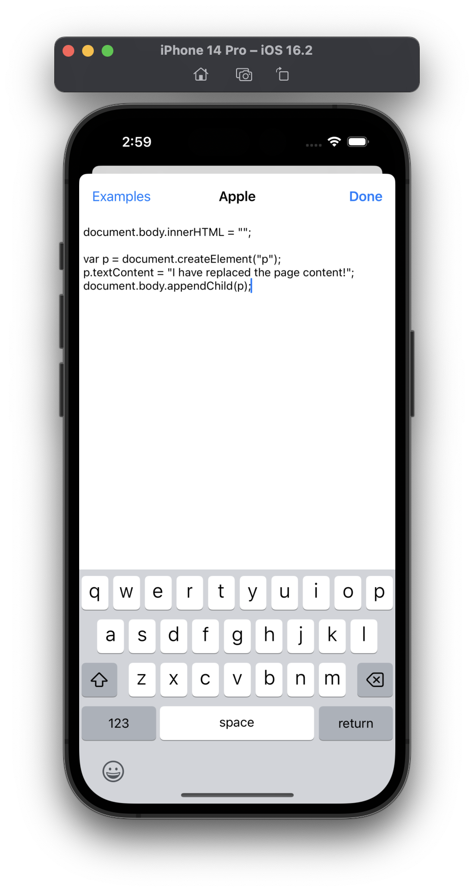
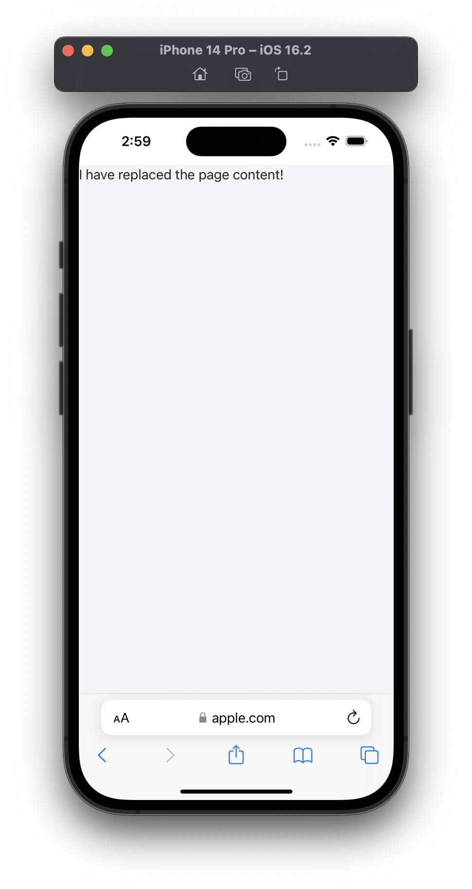
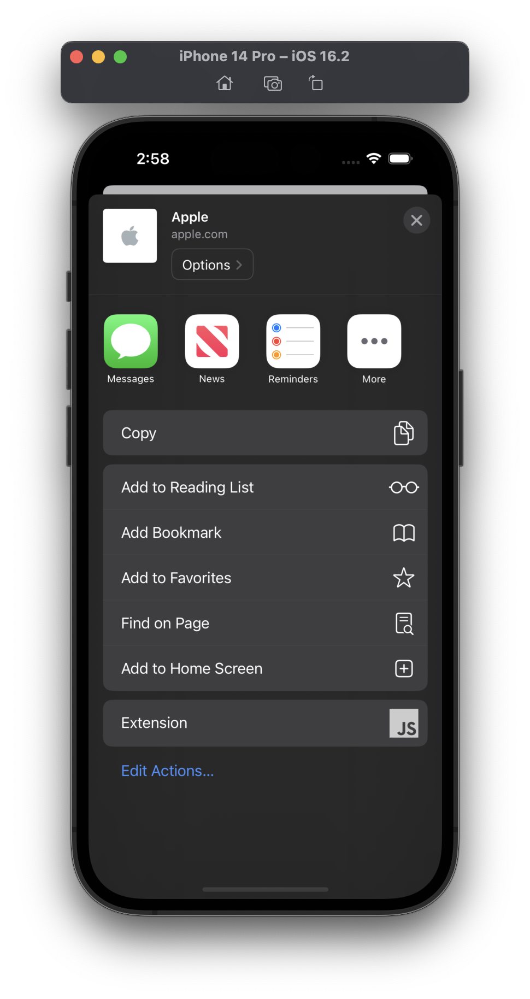
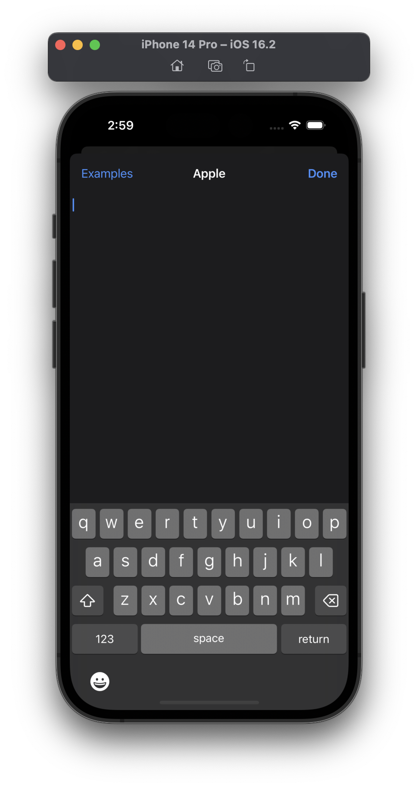
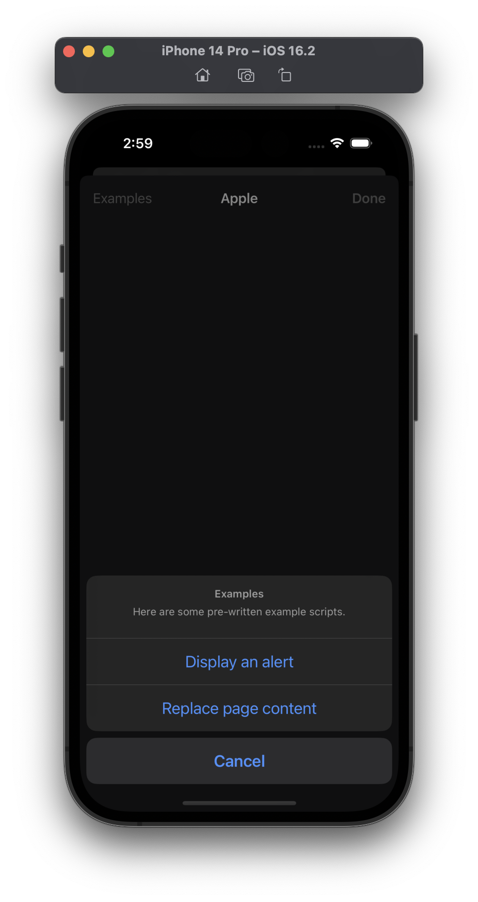
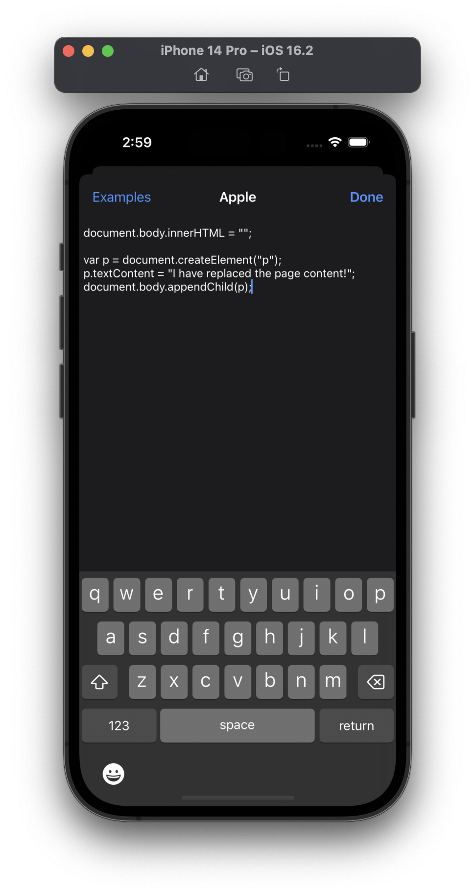
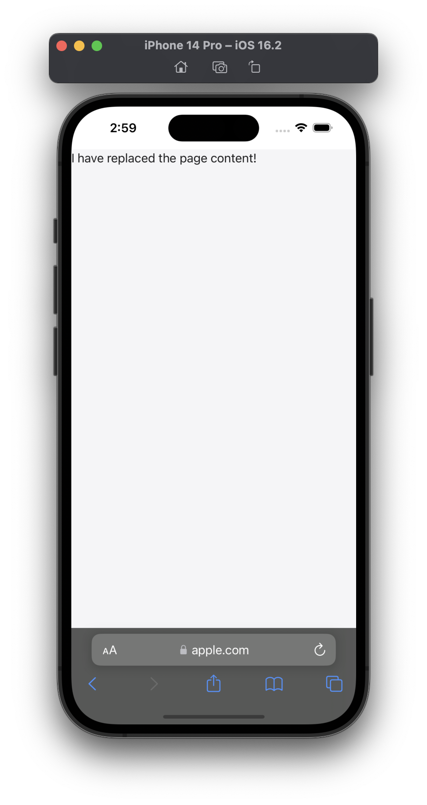

# Project 19 - JavaScript Injection

This project includes solutions to the challenges.

## Challenges

1. Add a bar button item that lets users select from a handful of prewritten example scripts, shown using a `UIAlertController` – at the very least your list should include the example we used in this project.
2. You're already receiving the URL of the site the user is on, so use `UserDefaults` to save the user's JavaScript for each site. You should convert the URL to a `URL` object in order to use its `host` property.
3. ~~For something bigger, let users name their scripts, then select one to load using a `UITableView`.~~ [MISSING]

## Screenshots

### Light Mode

  
  
  
  
  

### Dark Mode

  
  
  
  
  

