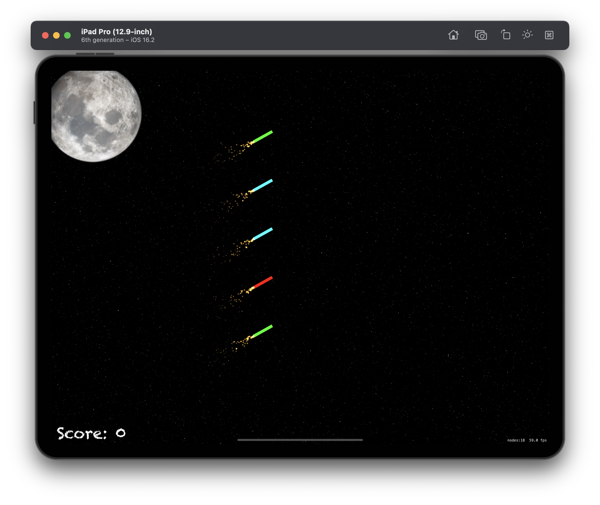
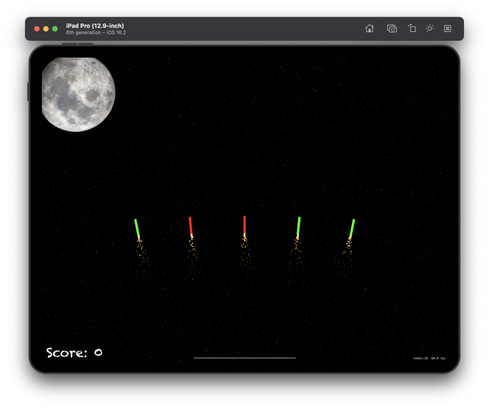
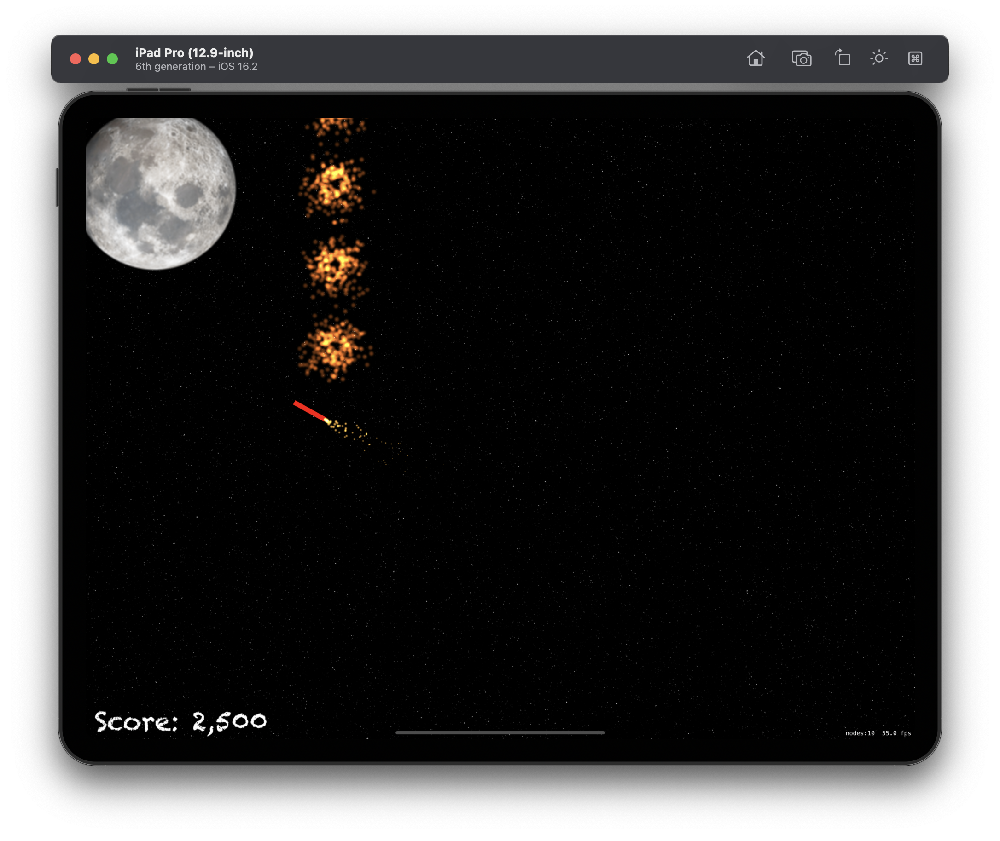
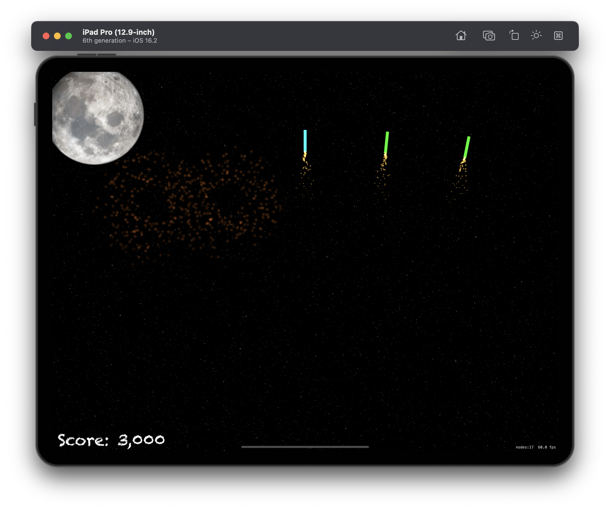
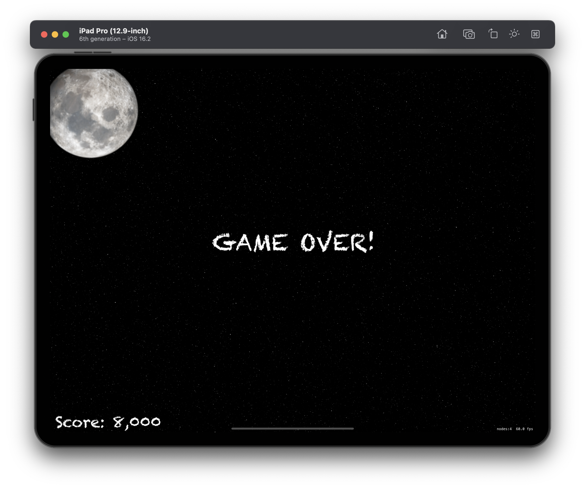

# Project 20 - Fireworks Night

This project includes solutions to the challenges.

## Challenges

1. For an easy challenge try adding a score label that updates as the player’s score changes.
2. Make the game end after a certain number of launches. You will need to use the `invalidate()` method of `Timer` to stop it from repeating.
Use the `waitForDuratio`n and `removeFromParent` actions in a sequence to make sure explosion particle emitters are removed from the game scene when they are finished.

## Screenshots (Universal)

  
  
  
  
  

