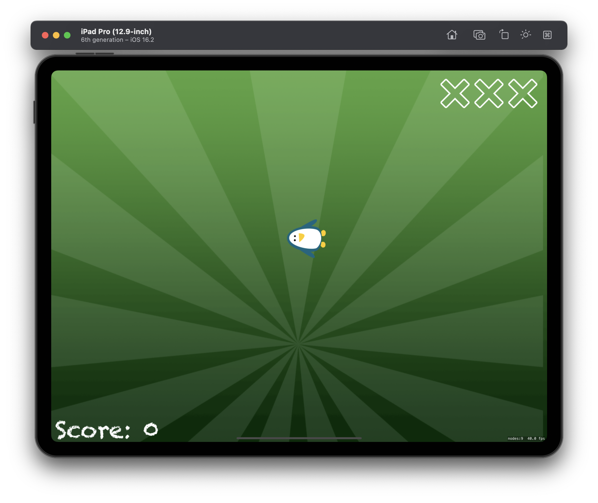
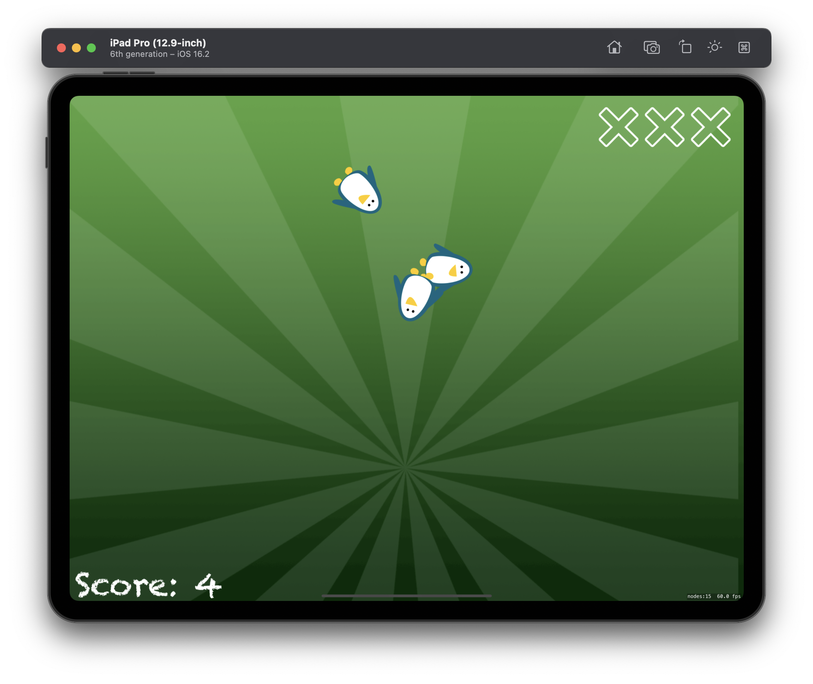
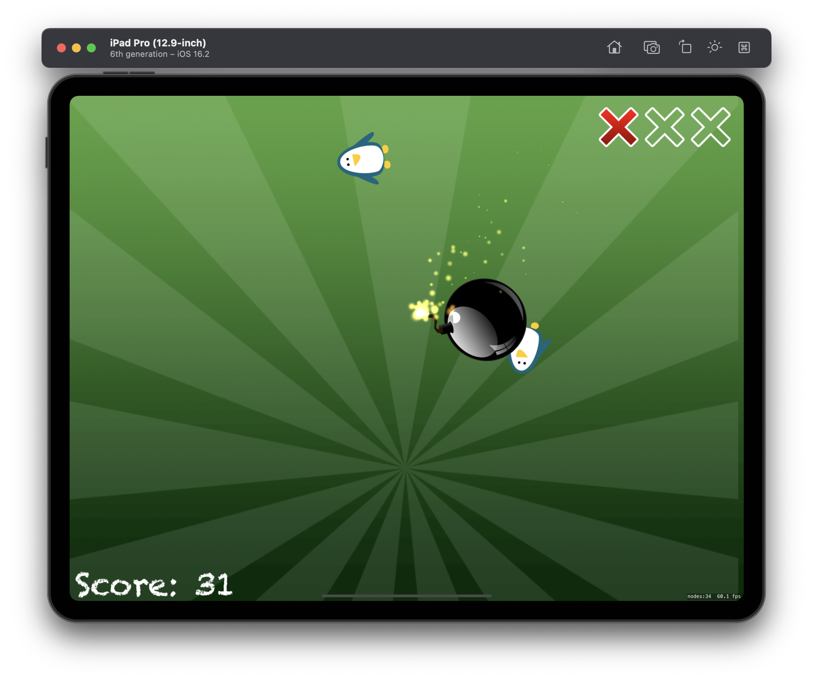
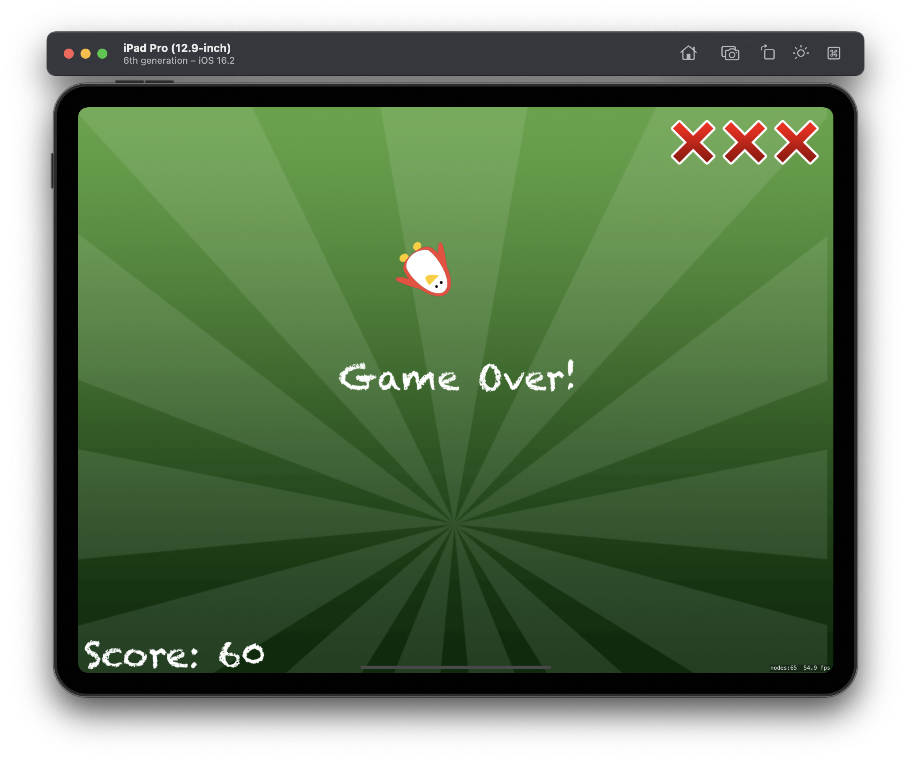

# Project 23 - Swifty Ninja

This project includes solutions to the challenges.

## Challenges

1. Try removing the magic numbers in the `createEnemy()` method. Instead, define them as constant properties of your class, giving them useful names.
2. Create a new, fast-moving type of enemy that awards the player bonus points if they hit it.
3. Add a “Game over” sprite node to the game scene when the player loses all their lives.

## Screenshots (Universal)

  
  
  
  
  

