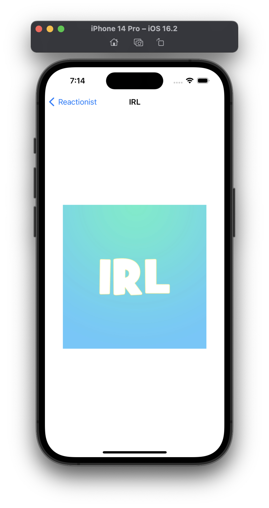

# Project 30 - Reactionist

This project includes solutions to the challenges.

## Challenges

1. Go through project 30 and remove all the force unwraps. Note: implicitly unwrapped optionals are not the same thing as force unwraps – you’re welcome to fix the implicitly unwrapped optionals too, but that’s a bonus task.
2. Pick any of the previous 29 projects that interests you, and try exploring it using the Allocations instrument. Can you find any objects that are persistent when they should have been destroyed?
3. ~~For a tougher challenge, take the image generation code out of `cellForRowAt:` generate all images when the app first launches, and use those smaller versions instead. For bonus points, combine the `getDocumentsDirectory()` method I introduced in project 10 so that you save the resulting cache to make sure it never happens again.~~ [MISSING]

## Screenshots (Light-Only)

### Light Mode

  
  

